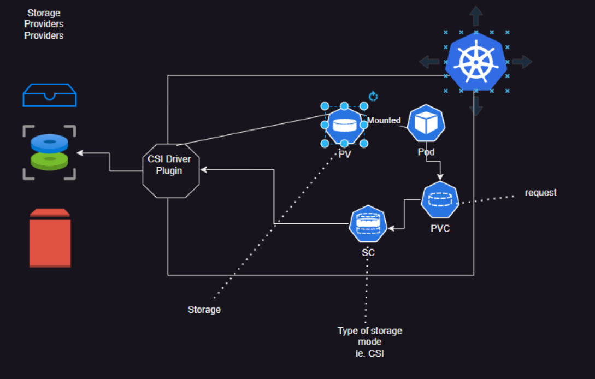
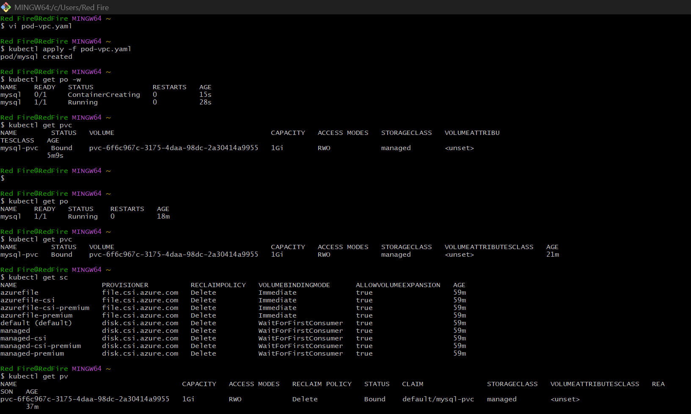
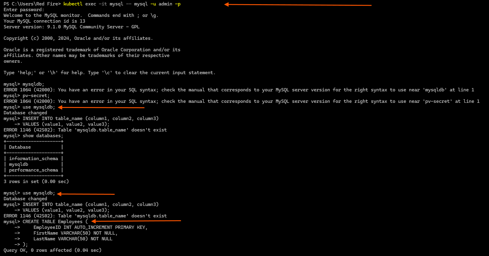
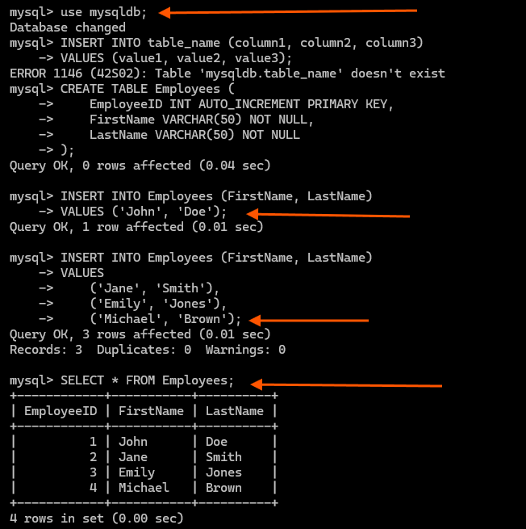
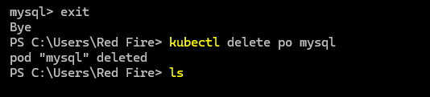
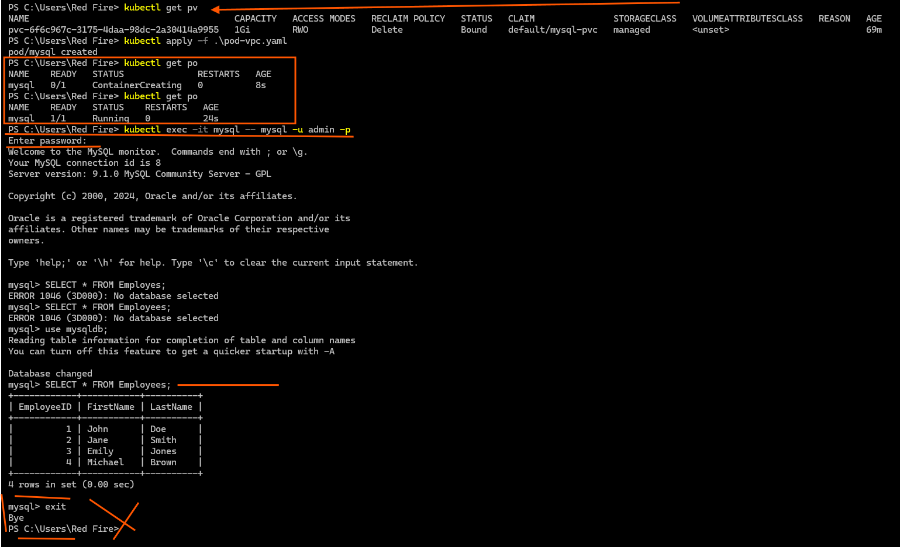

# Kubernetes Storage
25/Oct/2024

* CSI is a storage interface for  k8s 
* List of CSI drivers Refer Here: https://kubernetes-csi.github.io/docs/drivers.html   
   


*  Refer Here: https://kubernetes.io/docs/concepts/storage/persistent-volumes/ for official docs of PVs 
*  Refer Here: https://kubernetes.io/docs/concepts/storage/storage-classes/ for official docs of Storage Classes

# Access Modes :
  *  refer: https://kubernetes.io/docs/concepts/storage/persistent-volumes/#access-modes
  
  * RWO – ReadWriteOnce (Suitable for block storages like EBS,  Azure Disk, Persistent Disk)
  * ROX – ReadOnlyMany (Any disk)
  * RWX – ReadWriteMany (Typically fileshares or blob storages)
  * RWOP – ReadWriteOncePod (Suitable for block storages like EBS, Azure Disk, Persistent Disk)

* Refer Here: https://learn.microsoft.com/en-us/azure/aks/azure-csi-disk-storage-provision for using Azure Disk as PV   

* Lets create a mysql Pod where we create a persitent volume dynamically

```yaml
#mysql pod file
---
apiVersion: v1 
kind: Pod 
metadata:
  name: mysql 
spec:
  containers:
    - name: mysql
      image: mysql:9 
      ports: 
        - containerPort: 3306 
      resources:
        requests:
          memory: 128Mi 
          cpu: 250m 
        limits:
          memory: 512Mi
          cpu: 1000m 
      envFrom: 
        - secretRef:
            name: pv-secret
      volumeMounts:
        - name: libdb
          mountPath: /var/lib/mysql 
  volumes: 
    - name: libdb 
      persistentVolumeClaim:
        claimName: mysql-pvc

```
```yaml
#secrets file
---
apiVersion: v1
kind: Secret 
metadata:
  name: pv-secret
data: 
  MYSQL_ROOT_PASSWORD: cm9vdHJvb3Q=
  MYSQL_DATABASE: bXlzcWxkYg==
  MYSQL_USER: YWRtaW4=
  MYSQL_PASSWORD: cm9vdHJvb3Q=
```
```yaml
#pvc file
---
apiVersion: v1 
kind: PersistentVolumeClaim
metadata: 
  name: mysql-pvc
spec:
  accessModes: 
    - ReadWriteOnce
  resources:
    requests:
      storage: 1Gi 
  storageClassName: managed
---
```


* ` kubectl exec -it mysql -- mysql -u admin -p` 
* The command kubectl exec -it mysql -- mysql -u admin -p allows you to connect to a MySQL database running in a Kubernetes pod named "mysql" as the user "admin," prompting for a password to access the MySQL shell.


* after deletion of pod pvc is still present 

* so after deleting and recreating the pod i am geting my data back

*  Exercise: Try running mongodb with pvc and postgres with pvc 

# Necessity for database cluster  

  * To have HA we run database in multiple servers in the case of k8s multiple pods
  * IN db cluster we have multiple servers and each server will have its own storage
  * So we need to create pods and each pod should have its own persistent volume
  * challenge to create cluster with deployments: 
    * managing multiple PVs
    * pod names are not predictable: database clusters generally will have predictable endpoints (read endpoint, write endpoint)
  
  * So we need a way to create 
    * multiple pods and pvs
    * pod names should be predictable

* all of the above are achieved with stateful sets.
-------------------------------------------------------------------------------------------------------------------     

*  `When we create a Pod, it triggers the creation of a Persistent Volume Claim (PVC). The PVC communicates with the Container Storage Interface (CSI), which provisions the actual storage as a Persistent Volume (PV). The PV is then mounted to the Pod, making the storage accessible to the containers within it. `

* The diagram represents the Kubernetes storage provisioning workflow using the Container Storage Interface (CSI). Here's a step-by-step explanation of the process:
  
  1.  Storage Provider (CSI Driver Plugin): 
      * The CSI driver connects Kubernetes to the external storage providers (e.g., disks, NFS, cloud storage like AWS EBS, Azure Disks).
      * so for k8s speaks with this storage providers what this vendors do is they will try to create plugin which is called as CSI Driver Plugin.
      * It abstracts how storage is provisioned, mounted, and managed.
   
  2. Storage Class (SC)
      * An administrator defines a StorageClass object in Kubernetes.
      * It specifies the storage type (e.g., SSD, HDD) and parameters (e.g., replication factor).
      * The CSI driver uses this class to allocate the desired type of storage.

  3. Persistent Volume Claim (PVC)
      * A user (or Pod) creates a PVC to request storage.
      * The PVC specifies the storage requirements, such as size, access mode (ReadWriteOnce, ReadOnlyMany, etc.), and the StorageClass to use.
      * Kubernetes uses the PVC to dynamically provision a volume or bind to an existing Persistent Volume (PV).
  
  4. Persistent Volume (PV)
      * The CSI driver provisions the requested storage from the provider and creates a PV.
      * The PV represents the actual storage resource, such as a disk or NFS share, in Kubernetes.
  
  5. Binding PVC to PV
      * Kubernetes binds the PVC to the provisioned or existing PV.
      * The binding ensures the Pod gets the required storage.
 
  6. Pod Mounts PVC
      * A Pod specifies the PVC in its configuration (via volumeMounts).
      * Kubernetes ensures the PVC is mounted into the Pod, allowing the Pod to access the storage.

* PV (Persistent Volume): Represents the storage resource.
* PVC (Persistent Volume Claim): User's request for storage.
* SC (StorageClass): Template defining the storage type.
* Pod: Uses the mounted storage for its workloads.
* CSI Driver Plugin: Connects Kubernetes to storage providers for provisioning and management.

--------------------------------------------------------------------------------------------------------------------

* 


# Introduction


 1. Kubernetes has a system for managing storage that is separate from how compute instances (e.g., Pods) are managed.
 
 2. The PersistentVolume (PV) subsystem provides an API to help manage storage in Kubernetes.
PersistentVolume (PV): This is a piece of storage that is pre-provisioned or dynamically created for use by Kubernetes workloads. It can be storage from different sources, such as NFS, iSCSI, or cloud providers like AWS, GCP, etc.
 3. PersistentVolumeClaim (PVC): A request for storage made by a user. It is similar to how Pods request resources like CPU and memory. A user defines the size and access modes needed for storage.
Lifecycle of PV and PVC
Provisioning

 4. Static provisioning: The administrator pre-creates a set of PersistentVolumes and makes them available to users.
Dynamic provisioning: If no pre-created PVs match a PVC, Kubernetes will create a new PV on the fly based on the user's request and a StorageClass. The StorageClass defines the parameters of the dynamically provisioned storage.
Dynamic provisioning requires the DefaultStorageClass admission controller to be enabled in the cluster.
Binding

5. Once a PVC is created, Kubernetes looks for a matching PV. If a match is found, it binds the PVC to that PV.
This binding is one-to-one: a PVC is bound to only one PV and vice versa.
The binding process is automatic, and the volume is tied to the PVC for as long as the claim exists.
If no matching PV exists for a PVC, the claim will stay unbound until a matching PV is available.
Using PVs

6. Once a PVC is bound to a PV, that storage is available for use by Pods.
Pods refer to PVCs in their volumes section to mount the required storage.
Kubernetes will automatically mount the PV on the Pods.
Storage Object in Use Protection

7. If a PVC is being used by a Pod, it is protected from deletion to prevent data loss.
PVC or PV deletion is postponed until the object is no longer in use by any Pods.
Reclaiming PVs

8. After a PVC is deleted, the PV can either be retained, recycled, or deleted based on its reclaim policy.
Retain: The administrator manually handles the deletion and cleanup of the storage after the PVC is deleted.
Delete: The PV and the storage asset are both deleted automatically.
Recycle: The PV is scrubbed (all data is removed) and made available again for future claims (deprecated in favor of dynamic provisioning).

# Storage Classes
 
 1. A StorageClass defines different types of storage that administrators offer to users.
It allows Kubernetes to dynamically provision storage based on the class selected in a PVC. For example, a "fast" storage class could provide high-performance disks, while a "standard" class might use slower disks.

# Key Concepts

```
Access Modes: The way a volume can be mounted in a Pod. Options include:
ReadWriteOnce: The volume can be mounted as read-write by only one node.
ReadOnlyMany: The volume can be mounted as read-only by many nodes.
ReadWriteMany: The volume can be mounted as read-write by many nodes.
ReadWriteOncePod: The volume can be mounted as read-write by only one Pod.
```

# Common Commands

```
To see PersistentVolumes:
bash
Copy code
kubectl get pv
To see PersistentVolumeClaims:
bash
Copy code
kubectl get pvc
To describe a PVC or PV and check its details:
bash
Copy code
kubectl describe pvc <pvc-name>
kubectl describe pv <pv-name>
```

# Conclusion
 
 * PersistentVolumes and PersistentVolumeClaims provide a way to abstract storage management in Kubernetes, making it easier to manage storage resources and use them efficiently. By understanding PVs, PVCs, and StorageClasses, you can ensure that Kubernetes workloads get the storage they need with the right performance and access policies.

For your DevOps interviews, focusing on how storage is dynamically provisioned, bound to workloads, and the different reclaim policies will help you demonstrate your understanding of Kubernetes storage.

--------------------------------------------------------------------------------------------------------------------

# Questions  or points 


* ` When you create a MySQL pod, the data that you want to back up should be stored in a location provided by a storage provider.`

* `In Kubernetes (K8s), there are three interfaces: the Container Runtime Interface (CRI), which allows K8s to communicate with multiple container runtimes, and the Container Network Interface (CNI), which enables K8s to interact with various network implementations so that pods can communicate with each other.`

* can we communicate from pod which is running in the different namespace to the pod which is running . which is to running service to a different namespace ? what is the url for that? 
    * <svc-name>.<namespace >
    * `users-svc.dev`
    * curl https://users-svc.dev
  
* `Can we scale a database? If it is a NoSQL database, then yes, you can scale it. However, if it is a relational database, you are not supposed to scale it because you can only replicate it. When you create multiple databases, each database has its own copy of the data.`

* ` Static storage: means that you first create a Persistent Volume (PV), which you then make available to the pod.`

* `Dynamic storage: means that whenever I need storage, Kubernetes will automatically provision it for me. Since we are widely using cloud environments, this allows for seamless and efficient management of storage resources.`

* try to correct it and find it, what ut is ?
```
so can we comminicate from a pod to a service which is running in different namespaces 
------------------------------
= <service-name>.<namespaces>
  users-svc.dev 
  curl http://users-svc.dev 
----------------------------------
storage providers 
cri - cni - csi driver
statitic storage and dynamic storage 
pod-pvc-sc-csidriver-pv
----------------
storage classes mode in k8s 
-----------------------------

persistence volume storage store 
access mode 

rwo = only one pod get a read write access only 1 node attach disk on a node , 
rox= readonlyMany= in that vol
 arwop = only 1 pod get read write access
------------------
findout what mysql cluster and how it is difference from single database
```


# questions 

* i wnat to use Azure storage account blob storage for my persistent volume how to do it?
* how about using s3 eks cluster?
* give me step by  step apporach to s3 storage as persistent volume in EKS cluster?
* 

* Here’s a step-by-step guide to using Azure Blob Storage and Amazon S3 as persistent volumes in Kubernetes clusters, including AKS and EKS.

---

## **Using Azure Blob Storage for Persistent Volumes in AKS**

Azure Blob Storage can be integrated into AKS by using the Azure CSI driver. Below are the steps:

### **1. Prerequisites**
- Create an Azure Blob Storage account and container.
- Ensure your AKS cluster is running.
- Install the Azure Blob CSI driver:
  ```bash
  helm repo add blob-csi-driver https://raw.githubusercontent.com/kubernetes-sigs/blob-csi-driver/master/charts
  helm install blob-csi-driver blob-csi-driver/blob-csi-driver --namespace kube-system
  ```

### **2. Create a Secret for Storage Account**
Create a Kubernetes secret with your storage account credentials:
```bash
kubectl create secret generic azure-blob-secret --namespace default \
  --from-literal=accountname= \
  --from-literal=accountkey=
```

### **3. Define a Persistent Volume (PV)**
Create a `pv-blob.yaml` file:
```yaml
apiVersion: v1
kind: PersistentVolume
metadata:
  name: pv-blob
spec:
  capacity:
    storage: 1Ti
  accessModes:
    - ReadWriteMany
  persistentVolumeReclaimPolicy: Retain
  storageClassName: azureblob-nfs-premium
  csi:
    driver: blob.csi.azure.com
    volumeHandle: 
    volumeAttributes:
      resourceGroup: 
      storageAccount: 
      containerName: 
      protocol: nfs
```
Apply the PV:
```bash
kubectl apply -f pv-blob.yaml
```

### **4. Create a Persistent Volume Claim (PVC)**
Create a `pvc-blob.yaml` file:
```yaml
apiVersion: v1
kind: PersistentVolumeClaim
metadata:
  name: pvc-blob
spec:
  accessModes:
    - ReadWriteMany
  resources:
    requests:
      storage: 10Gi
  storageClassName: azureblob-nfs-premium
```
Apply the PVC:
```bash
kubectl apply -f pvc-blob.yaml
```

### **5. Use the PVC in a Pod**
Create a pod manifest (`nginx-pod-blob.yaml`) that uses the PVC:
```yaml
apiVersion: v1
kind: Pod
metadata:
  name: nginx-blob
spec:
  containers:
    - name: nginx-container
      image: nginx:latest
      volumeMounts:
        - mountPath: "/mnt/blob"
          name: blob-storage-volume
  volumes:
    - name: blob-storage-volume
      persistentVolumeClaim:
        claimName: pvc-blob
```
Apply the pod manifest:
```bash
kubectl apply -f nginx-pod-blob.yaml
```

---

## **Using Amazon S3 as Persistent Volume in EKS**

Amazon S3 can be used as persistent storage in EKS by leveraging the Mountpoint for Amazon S3 CSI driver.

### **1. Prerequisites**
- Create an Amazon S3 bucket.
- Ensure your EKS cluster is running.
- Install the Mountpoint for Amazon S3 CSI driver.

### **2. Install the CSI Driver**
Install the driver using Helm or kubectl. Example with Helm:
```bash
helm repo add aws-ebs-csi-driver https://kubernetes-sigs.github.io/aws-ebs-csi-driver/
helm install s3-csi-driver aws-ebs-csi-driver/aws-ebs-csi-driver --namespace kube-system
```

### **3. Create a Storage Class**
Define a `storageclass.yaml` file for S3 storage class:
```yaml
apiVersion: storage.k8s.io/v1
kind: StorageClass
metadata:
  name: s3-storageclass
provisioner: s3.csi.aws.com # Provisioner for AWS S3 CSI Driver.
parameters:
  type: standard # Bucket type.
```
Apply it with:
```bash
kubectl apply -f storageclass.yaml
```

### **4. Create a Persistent Volume (PV)**
Define an `s3-pv.yaml` file for the PV configuration:
```yaml
apiVersion: v1
kind: PersistentVolume
metadata:
  name: s3-pv
spec:
  capacity:
    storage: 1Gi # Placeholder value; ignored by S3.
  accessModes:
    - ReadWriteMany # Supported modes.
  csi:
    driver: s3.csi.aws.com # Required driver.
    volumeHandle: s3-volume-handle # Unique identifier.
    volumeAttributes:
      bucketName: 
      region: 
```
Apply it with:
```bash
kubectl apply -f s3-pv.yaml
```

### **5. Create a Persistent Volume Claim (PVC)**
Define an `s3-pvc.yaml` file for claiming the PV resource:
```yaml
apiVersion: v1
kind: PersistentVolumeClaim
metadata:
  name: s3-pvc
spec:
  accessModes:
    - ReadWriteMany # Supported modes.
  resources:
    requests:
      storage: 1Gi # Placeholder value; ignored by S3.
```
Apply it with:
```bash
kubectl apply -f s3-pvc.yaml 
```

### **6. Use the PVC in a Pod**
Define a pod manifest (`nginx-s3-pod.yaml`) that uses this PVC for mounting S3 storage into containers.
```yaml 
apiVersion: v1 
kind Pod

