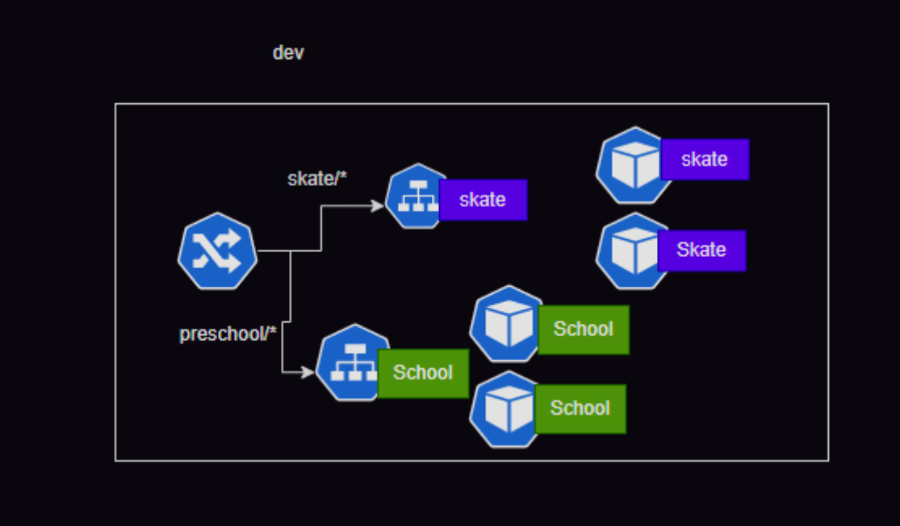

# Ingress and Ingress Controllers

27/Oct/2024

# [Ingress](https://kubernetes.io/docs/concepts/services-networking/ingress/)

# [Ingress Controller](https://kubernetes.io/docs/concepts/services-networking/ingress-controllers/)  

# [Nginx controller](https://www.f5.com/products/nginx/nginx-ingress-controller)
   
   * to install nginx controller:
       
       ```
        kubectl get pods -n ingress-nginx

        kubectl get pods --all-namespaces
        
        kubectl create namespace ingress-nginx
        
        kubectl apply -f https://raw.githubusercontent.com/kubernetes/ingress-nginx/controller-v1.9.6/deploy/static/provider/cloud/deploy.yaml
        
        kubectl get pods -n ingress-nginx -w
            
            # Wait until all pods show STATUS=Running.
       ```  
* Lets look at our apps
    * redfiree/preschool:1.0
        * This runs a preschool app on path /preschool on port 80

    * redfiree/skateboard:1.0
        * This runs a skate board app on path /skate on port 80



* Refer Here for the deployment manifest with images and service with clusterip
* K8s doesnot have a default ingress implementation, for this exercise lets use nginx ingress controller

* Now lets write ingress rules [Refer Here](https://github.com/asquarezone/KubernetesZone/commit/e341bebfa6e8aa40cc588d08c486ad99e691a150)


# Installing nginx ingress controller

* To install the NGINX Ingress Controller using kubectl, follow these steps:

* Steps to Install NGINX Ingress Controller

1. Create a Namespace:
    First, create a namespace for the NGINX Ingress Controller:
    
    ```bash
    kubectl create namespace ingress-nginx
    ```
2. Apply the NGINX Ingress Controller Manifest:
    Use the following command to deploy the NGINX Ingress Controller by applying the official manifest:
    ```
    kubectl apply -f https://raw.githubusercontent.com/kubernetes/ingress-nginx/main/deploy/static/provider/cloud/deploy.yaml

    ```
3. Verify the Deployment:
    Check that the NGINX Ingress Controller pods are running:
    ```
    kubectl get pods --namespace ingress-nginx
    ```

4. Check the Service:
    To see if the NGINX Ingress Controller has been assigned a public IP address, run:
    ```
    kubectl get svc --namespace ingress-nginx
    ```
    Look for the service of type LoadBalancer and note its EXTERNAL-IP. It may take a few minutes for the IP to be assigned.

5. Troubleshooting:
    If the EXTERNAL-IP status shows as Pending, you can investigate further with:
    ```
    kubectl describe svc -n ingress-nginx ingress-nginx-controller
    ```

    * By following these steps, you will have successfully installed the NGINX Ingress Controller on your Kubernetes cluster. This setup allows you to manage incoming traffic and route it to your services based on defined rules.


# Kubernetes [Metrics Service](https://kubernetes-sigs.github.io/metrics-server/) 

# Github [Metrics Server](https://github.com/kubernetes-sigs/metrics-server)

# Horizontal Pod Autoscaler
[ Refer here](https://kubernetes.io/docs/tasks/run-application/horizontal-pod-autoscale/)

```yaml
---
apiVersion: autoscaling/v2
 kind: HorizontalPodAutoscaler
 metadata:
   name: preschool-hpa
 spec:
   scaleTargetRef:
     apiVersion: apps/v1
     kind: Deployment
     name: preschool-deploy
   minReplicas: 1
   maxReplicas: 10
   metrics:
   - type: Resource
     resource:
       name: cpu
       target:
         type: Utilization
         averageUtilization: 70
---

apiVersion: autoscaling/v2
 kind: HorizontalPodAutoscaler
 metadata:
   name: skate-hpa
 spec:
   scaleTargetRef:
     apiVersion: apps/v1
     kind: Deployment
     name: skate-deploy
   minReplicas: 1
   maxReplicas: 10
   metrics:
   - type: Resource
     resource:
       name: cpu
       target:
         type: Utilization
         averageUtilization: 70
```

# Vertical Pod Autoscaler
 [Refer here](https://kubernetes.io/docs/concepts/workloads/autoscaling/)
 
# Network Policy
[ Refer Here](https://kubernetes.io/docs/concepts/services-networking/network-policies/)

* If you want to control traffic flow at the IP address or port level (OSI layer 3 or 4), NetworkPolicies allow you to specify rules for traffic flow within your cluster, and also between Pods and the outside world. Your cluster must use a network plugin that supports NetworkPolicy enforcement.

**Simple Explanation:**

- If you want to decide which computers or apps (called Pods) in your Kubernetes cluster can talk to each other, or to things outside the cluster, you can use something called a *NetworkPolicy*.
- NetworkPolicies let you set rules based on:
  - The IP address (like a street address for computers)
  - The port number (like a door number for different services on a computer)
- These rules work at OSI Layer 3 (network, which is about IP addresses) and Layer 4 (transport, which is about ports and protocols like TCP/UDP).
- You can use these rules to:
  - Allow or block certain types of network traffic between Pods inside your cluster
  - Control which Pods can be accessed from outside the cluster, and which Pods can access the outside world.
- But, for these rules to actually work, your Kubernetes cluster must use a special network plugin that understands and enforces NetworkPolicies. If you don’t have this plugin, the rules you write won’t do anything.

**In summary:**  
NetworkPolicies are like security guards that you set up to control which Pods can talk to each other or to the outside, based on their IP address or port. But you need the right network plugin in your cluster for these guards to actually do their job.

* NetworkPolicies in Kubernetes are rules that control which Pods can communicate with each other or with the outside world. However, not all Container Network Interface (CNI) plugins support enforcing these policies. This means:

- You can write and apply NetworkPolicy objects in your cluster, but unless your CNI plugin supports them, these rules will not actually have any effect on the network traffic[2][6].
- Popular CNI plugins like **Calico** and **Cilium** fully support NetworkPolicies, while others, such as **Flannel**, do not.
- Some CNI plugins may only support a subset of NetworkPolicy features, or may behave differently for certain protocols or policy types.
- If you are using a managed Kubernetes service (like AWS EKS or Azure AKS), support for NetworkPolicies is often enabled by default, but you should still confirm your CNI plugin’s capabilities.

**Summary:**  
Not all CNI plugins can enforce NetworkPolicies. You must use a CNI that supports them (like Calico or Cilium) for your NetworkPolicy rules to work as intended[2][5][6]. If your cluster uses a CNI without this support (like Flannel), NetworkPolicies will not restrict any traffic.

------------------------------------------------------------------------------------------------

* Ensure you have a CNI plugin with network policies enabled


This diagram shows a simple microservices architecture in Kubernetes, where different services and their related components are separated by function. Here’s what each part means:

## **Components in the Diagram**

- **frontend-svc**:  
  This is the *frontend service* that handles requests from users. It connects to a Pod labeled `app: fe` (frontend application).

- **users-svc**:  
  This is the *users service*. It connects to a Pod labeled `app: users` (users application).

- **users-db**:  
  This is the *database* for the users service. It connects to a Pod labeled `db: users` (users database).

- **books-svc**:  
  This is the *books service*. It connects to a Pod labeled `app: books` (books application).

- **books-db**:  
  This is the *database* for the books service. It connects to a Pod labeled `db: books` (books database).

## **How It Works**

- Each **service** (svc) is responsible for routing traffic to the correct application Pod.
- Each application Pod (like `app: users` or `app: books`) handles business logic for that part of the system.
- Each application has its own **database Pod** (like `db: users` or `db: books`) for storing data.
- The frontend communicates with the backend services (users and books), which in turn talk to their respective databases.

## **Summary Table**

| Service/Pod   | Purpose                        | Label         |
|---------------|-------------------------------|---------------|
| frontend-svc  | Handles user requests          | app: fe       |
| users-svc     | Manages user logic             | app: users    |
| users-db      | Stores user data               | db: users     |
| books-svc     | Manages books logic            | app: books    |
| books-db      | Stores books data              | db: books     |

**In simple terms:**  
This setup separates the frontend, user management, and book management into different services and databases, making the system modular and easier to manage. Each service has its own application and its own database.

------------------------------------------------------------------------------------------------

```yaml
apiVersion: networking.k8s.io/v1
kind: NetworkPolicy
metadata:
  name: users-db-np
spec:
  podSelector:
    matchLabels:
      db: users
  policyTypes:
    - Ingress
  ingress:
    - from:
        - podSelector:
            matchLabels:
              app: users
```


# Kubernetes Authentication and Authorization
   
   [Refer Here](https://kubernetes.io/docs/reference/access-authn-authz/authentication/)

   * Kubeconfig file contains
    
    A **kubeconfig file** is a configuration file used to connect and authenticate to a Kubernetes cluster. It is written in YAML format and contains all the information needed for tools like `kubectl` to communicate with the cluster.

### **What does a kubeconfig file contain?**

- **Clusters:**  
  Information about one or more Kubernetes clusters, including the API server address and certificate authority data (to securely connect).


- **Users:**  
  Credentials for users or service accounts, such as tokens, usernames/passwords, or client certificates, used to authenticate with the cluster.


- **Contexts:**  
  A context is a combination of a cluster, a user, and optionally a namespace. It tells `kubectl` which cluster and user to use for commands.


- **Current Context:**  
  Specifies the default context that will be used if you don’t specify one when running commands.

### **Example Structure**
```yaml
apiVersion: v1
clusters:
- cluster:
    certificate-authority-data: 
    server: https://your-cluster-api-server
  name: my-cluster
users:
- name: my-user
  user:
    token: 
contexts:
- context:
    cluster: my-cluster
    user: my-user
    namespace: default
  name: my-context
current-context: my-context
```

### **Summary Table**

| Section         | What it contains                                 |
|-----------------|--------------------------------------------------|
| clusters        | Cluster name, API server address, CA certificate |
| users           | User credentials (token, cert, etc.)             |
| contexts        | Cluster + user (+ namespace) combinations        |
| current-context | Default context to use                           |

**In simple terms:**  
The kubeconfig file tells Kubernetes tools how to find your cluster, how to prove who you are, and which cluster/user/namespace to use by default.

* clusters information: Foreach cluster we have url and cluster certificate
 

* context: which cluster and which namespace is default

# Overview
   

* 1. Authentication: Who are you? / (idproof)
      
      * Authentication is the first step.
            * Kubernetes checks your identity using things like passwords, certificates, or tokens.
            * If you prove who you are, you move to the next step  
        * K8s does not have inbuild identity system
        * k8s authentication is pluggable
        * k8s usermanagement is external identity
          * azure: azure ad
          * aws: iam
          * oidc
          * ad
            

* 2. Authorization: What are you allowed to do?

     * Authorization in Kubernetes determines what actions users can perform after they've been authenticated. While Kubernetes supports multiple authorization mechanisms, RBAC (Role Based Access Control) is the most widely adopted method.

     * RBAC Components and How They Work:
       * Authorization is also pluggable but RBAC (Role Based ACcess control) is most widely adopted authorization technique

       * Namespace-Level Access Control
            
          * **Role:** 
              * You define the permission level at namespace
              * Defines specific permissions within a single namespace
              * Specifies what resources (Pods, Services, etc.) can be accessed
              * Defines what actions (get, list, create, update, delete) are allowed on those resources
              * Limited to the namespace where it's created
      
          * **RoleBinding**
              * Attaching a Role to a user/serviceaccount
              * Creates a connection between a Role and users/service accounts
              * Essentially says: "This user/service account has these specific permissions in this namespace"
              * Multiple users can be bound to the same Role

          * **Cluster-Level Access Control**
                
                **ClusterRole**
                   * You define the permission level at cluster
                   * Similar to a Role but applies across the entire cluster
                   * Used for cluster-wide resources (Nodes, PersistentVolumes) that aren't namespace-specific
                   * Also used for non-resource URLs (like /healthz)
                   * Can be referenced by RoleBindings (for namespace-specific permissions) or ClusterRoleBindings
      
          * **ClusterRoleBinding**
               * Attaching a clusterrole to a user/serviceaccount
               * Gives users cluster-wide permissions defined in the ClusterRole
               * Applies these permissions across all namespaces
 
       * Authorization happens after authentication.
       * Kubernetes checks what actions you’re allowed to perform (like reading, creating, or deleting resources).
       * This is usually managed by Role-Based Access Control (RBAC), which assigns permissions to users or groups

# Example Scenario:
    
   * A developer might need permission to view Pods in the "development" namespace but not modify them. An admin would create a Role with "get" and "list" permissions on Pods, then use a RoleBinding to connect this Role to the developer's account. Meanwhile, a cluster administrator might need cluster-wide permissions, requiring a ClusterRole and ClusterRoleBinding.

   * This RBAC system allows Kubernetes administrators to implement the principle of least privilege, ensuring users and services have only the permissions they need to function.
   
    * ServiceAccounts: This is part of k8s [Refer Here](https://kubernetes.io/docs/concepts/security/service-accounts/) for official docs

# Question 

```
How do I create a ClusterRole
What are the steps to bind a ClusterRole to a service account
How can I list all the Roles and ClusterRoles in a Kubernetes cluster
What are the differences between RoleBinding and ClusterRoleBinding
How do I modify an existing Role or ClusterRole
```
**Role example**

```yaml

apiVersion: rbac.authorization.k8s.io/v1
kind: Role
metadata:
  namespace: default  # Specify the namespace
  name: readonly
rules:
  - apiGroups: ["*"]
    resources: ["*"]
    verbs: ["get", "list", "watch"]
```
**Role Binding**   

```yaml
apiVersion: rbac.authorization.k8s.io/v1
kind: RoleBinding
metadata:
  name: readonly-user-binding
  namespace: default  # Specify the namespace
subjects:
  - kind: User  # or Group if using groups
    name: user1aksadmin@yourdomain.com  # The user's email
    apiGroup: rbac.authorization.k8s.io
roleRef:
  kind: Role
  name: readonly
  apiGroup: rbac.authorization.k8s.io
```

* Every Pod by default mounts the service account token of default service account, which is not a good practice


* 3. Admission Control: Should this request be allowed?

        * Even if you are authenticated and authorized, Kubernetes has one more check called admission control.
        * Admission controllers can approve or reject your request based on extra rules (like security policies).

* 4. etcd: Storing the Data

        * If your request passes all checks, it is saved in Kubernetes’ database, called etcd.


### **Summary Table**

| Step               | What it does                                              |
|--------------------|----------------------------------------------------------|
| Authentication     | Checks who you are (identity)                            |
| Authorization      | Checks what you’re allowed to do (permissions)           |
| Admission Control  | Applies extra rules before allowing the request          |
| etcd               | Stores the approved request in the cluster’s database    |

---

**In simple terms:**  
Kubernetes first checks who you are, then checks what you’re allowed to do, then applies extra rules, and finally saves your request if everything is okay

