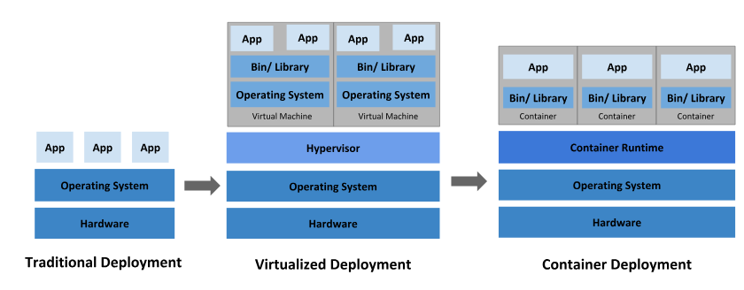
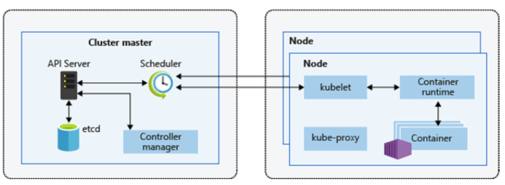
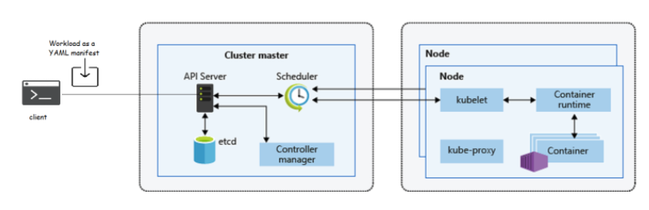
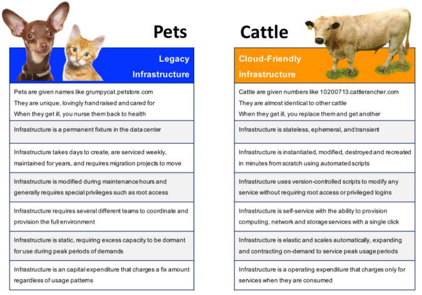
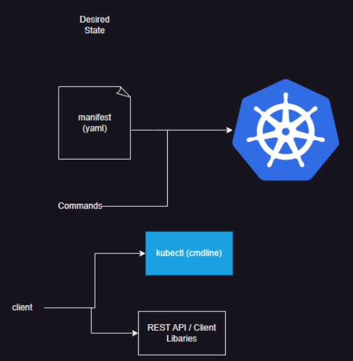
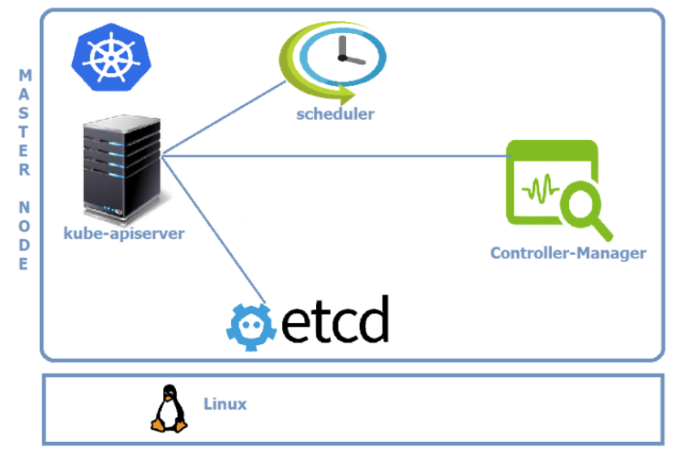
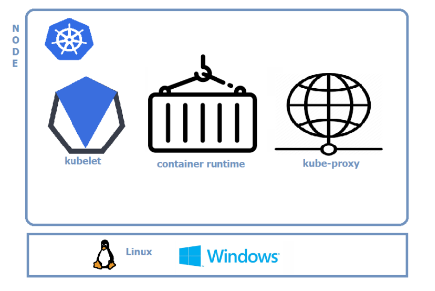
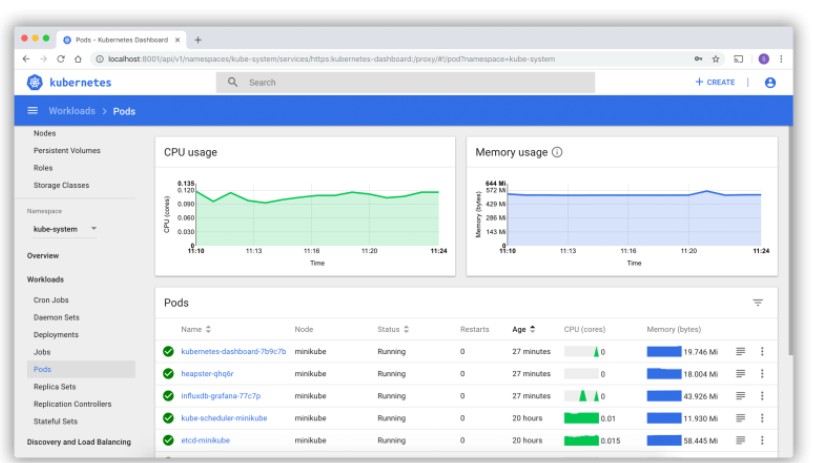
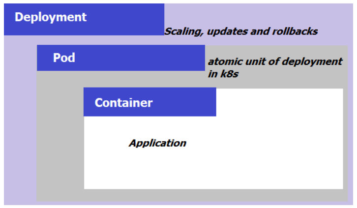
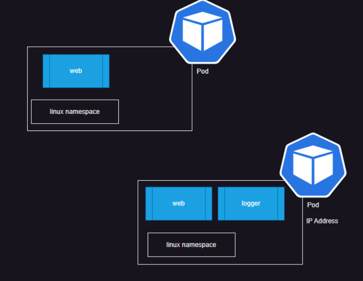

# Kubernetes Architecture

* Refer here for k8s Architecture: https://directdevops.blog/2019/10/09/kubernetes-introduction/

# Kubernetes – Introduction

* Overview of Containers

* __Why do we need Kubernetes__

* __Question or Concerns about containers__ 

 * Containers are wonderful way of bundling and running your  applications, But are they production ready?
 * What would happen if container or the  Docker Host goes down?
 * How to make containers available 24*7 ?
 * How to handle loads during peak time for the applications ?
 * How to replace containers without having downtime with new Docker Image based containers ?
 * How to monitor containers?

* __Solution to above Questions or Concerns__

 * Wouldn’t it be good if there is some system which can help for handling all the questions/concerns raised in above section. That exactly what Kubernetes does.
   
   * Kubernetes takes care of
   * Scaling requirements
   * failover
   * deployment patterns
 
 * Kubernetes Provides
   
   * Service Discovery & Load Balancing
   * Storage Orchestration
   * Automated rollouts and rollbacks
   * Automated bin packing
   * Self-Healing
   * Secret & Configuration Management

* Kubernetes is not only for the open source community embraced containers, It is deeply embraced by the Cloud Providers.
   
   * Amazon Web Service offers Elastic Kubernetes Services(EKS)
   * Google Cloud platform offers Google Kubernetes Engine(GKE)
   * Microsoft Azure offers Azure Kubernetes Services(AKS)

* # What is Kubernetes

   * Kubernetes is a platform that manages container-based applications, their networking and storage components.
   * In Kubernetes, we focus on the application workloads rather than the underlying infrastructure.
   * Kubernetes provides a declarative approach to deployments, backed by a rich set of APIs for management operations.
   
   * Cluster: 
        * Cluster is collection of compute, storage and networking resources that Kubernetes uses to run workloads.       
   
   * Node: 
        * It is a single host. Now we can put the cluster as collection of nodes. 

   * Kubernetes has two kinds of Nodes 
   
       * Master: 
          * Provides core Kubernetes Services and orchestration to application workloads
          
       * Node:
          * run your application workloads
  
* # Kubernetes Cluster Architecture

# What would be our approach with workloads in Kubernetes?

* We would be describing our application as YAML manifest and pass it to Kubernetes master from some client, and Cluster Master does the rest.

* # Pets Vs Cattle

* I have found a interesting image in cloudrumblings.io, See the reference below 

* In Kubernetes we follow cattle analogy and we would be discussing more in next series of articles

---------------------------------------------------------------------------

# Kubernetes Architecture

*  We express our desired state in yaml or imperative command and use a client (kubectl) to communicate with k8s and k8s does the rest.

* # Kubernetes Master and Node Components
   
   * __Kubernetes Master__  

 
   * Kubernetes master runs on Linux nodes

* __Master Components__ 

   * __kube-apiserver__
     
     * This component is Central to Kubernetes. All communications between all components goes through the kube-apiserver
     * This component is frontend of the Kubernetes control plane.
     * This component exposes a REST API.
     * We would interact with this component using kubectl by using the YAML files, which are also referred as manifests
   
   * __etcd__
     
     * etcd stores the entire configuration and the state of the cluster.
     * etcd is consistent and highly available distributed key-value store.

   * __kube-scheduler__ 
   
     * kube-scheduler watches for new work tasks and assigns them to healthy nodes in the cluster

   * __Controller-Manager__
     
     * It is responsible for maintaining desired states mentioned in the manifest.
     * It looks like single component, but with in it has 
        * Node Controller: for noticing & responding when node goes down
        * Replication Controller: for maintaining the correct number of pods for every replication controller object.
        * Endpoints Controller: Populates the Endpoints object
  
   * __Cloud-Controller-manager__
   
    * If you run the Kubernetes on a supported cloud platform such as AWS, Azure or Google, your control plane runs the Cloud-Controller-Manager.
    * It is responsible for underlying cloud specific controllers.

* # Node Components

* # kubelet

  * This is an agent which runs on each node in the cluster.
  * It watches for the instructions from API Server for new work assignments.
  * If it can’t run the task assigned, it reports back to master and lets control plane decide on the actions.
  * It is responsible for the node registration process

* # Container Runtime

  * This is software which is responsible for running containers.
  * Some of them are Docker, containerd, cri-o, rktlet

* # kube-proxy

  * Maintains the network rules on nodes
  * This is responsible for networking on nodes.

* # Cluster DNS

  * Every Kubernetes Cluster has an internal DNS service
  * This has static IP address that is hardcoded into every Pod on the cluster i.e. all Pods now how to find the DNS Server
  * Services, Stateful Sets and Pods are registered with Cluster DNS.
  * Cluster DNS is based on CoreDNS

# Interesting ADD ONS
  * __Web UI (Dashboard)__
  

  * Web based Kubernetes user interface
  * Capabilities: 
     
     * Deployment
     * View cluster resources
     * Troubleshooting

# Container Resource Monitoring & Cluster Level Logging

# How to Package Apps To Run on Kubernetes

* Package your application as container image. 
  * We would create a Image for the application
  * Push the image to Docker Registry
* Pod will Wrap container
* Pod is deployed into Kubernetes cluster via Declarative Manifest file.

---------------------------------------------------------------------------

# Ways to setup Kubernetes

* Single System (Developer): 
      * This is workstation environment for developmental purposes, Here we have following major options 
         * minikube
         * kind

* Self Hosted 
      * kubeadm
      * kubespray (install k8s using ansible )

* Cloud Hosted 
      * AWS: Elastic Kubernetes Services (EKS)
      * Azure: Azure Kuberenetes Services (AKS)
      * GCP: Google Kubernetes Engine (GKE)

# Kubernetes stopped supporting docker    

 * kubernetes uses a interface called as CRI (Container Runtime Interface)
 * kubernetes used to ship dockershim to interact with docker containers
 * In K8s release 1.21 dockershim was removed 
      * Refer Here: https://kubernetes.io/blog/2020/12/02/dont-panic-kubernetes-and-docker/
       
 * Mirantis and many other communties have developed CRI for docker 
      * Refer Here: https://github.com/Mirantis/cri-dockerd

* # Kubernetes workloads
      
      * Pod
      * ReplicaSet/ReplicationController
      * Deployment
      * DaemonSet
      * StatefulSet
      * Service
      * Ingress
      * Labels
      * Namespaces and so on.......

* # Pod
      
      * This is the smallest unit of creation by k8s
      * A Pod has one or more containers in it
      * Every Pod gets a unique ipaddress
          
