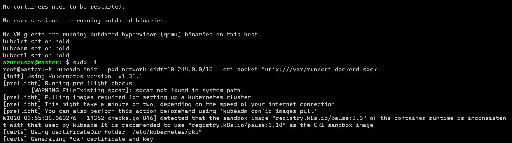
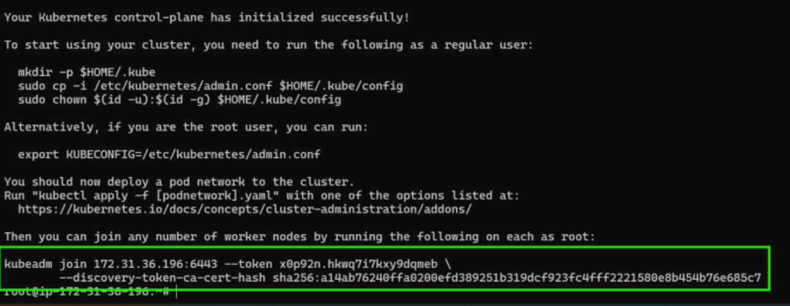
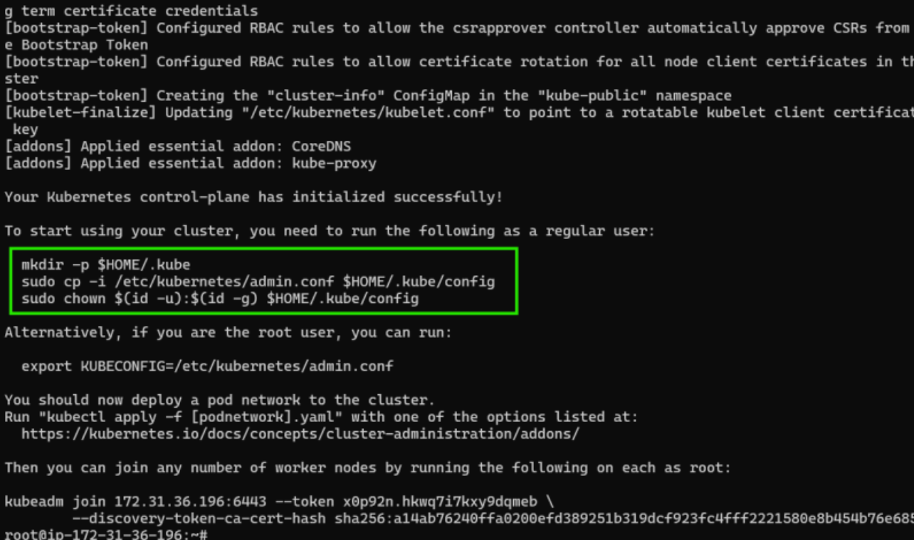
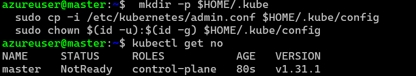
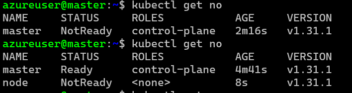
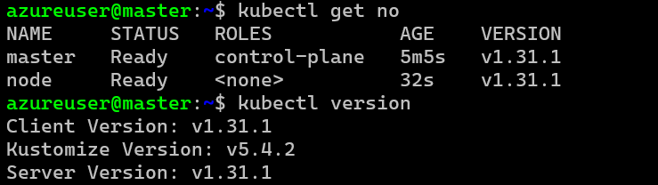

# K8s Installation (Self hosted)

* Lab setup 
  * 2 ubuntu 22.04 
  * ensure they can reach each other

* For installation of  k8s we will be using kubeadm
* High Level overview 
  * install docker on all nodes
  * install cri-dockerd on all nodes
  * installing kubeadm, kubectl on all nodes
  * initialize the cluster on master node and this command gives join command which we will be executing on nodes
  * Configure kubectl
  * For Networking between Pods,  Kubernetes needs CNI-Plugins
  * We will be installing Flannel CNI Plugins
  * kubeadm install: 
       * refer: https://kubernetes.io/docs/setup/production-environment/tools/kubeadm/install-kubeadm/
       * for user data
 
  * install docker on all vms (on master and nodes) 
   
```
#!/bin/bash
curl -fsSL https://get.docker.com -o install-docker.sh
sh install-docker.sh
sudo usermod -aG docker ubuntu(username)
```
* Installing CRI-dockerd  for releases page on all nodes 
     * Refer Here:https://github.com/Mirantis/cri-dockerd/releases

```
 cd /tmp
wget https://github.com/Mirantis/cri-dockerd/releases/download/v0.3.15/cri-dockerd_0.3.15.3-0.ubuntu-jammy_amd64.deb
sudo dpkg -i cri-dockerd_0.3.15.3-0.ubuntu-jammy_amd64.deb 

```

* Install kubeadm, kubectl, kubelet on all nodes 
     * Refer Here: https://kubernetes.io/docs/setup/production-environment/tools/kubeadm/install-kubeadm/#installing-kubeadm-kubelet-and-kubectl

* These instructions are for Kubernetes v1.31.
* Update the apt package index and install packages needed to use the Kubernetes apt repository: 

```
sudo apt-get update
# apt-transport-https may be a dummy package; if so, you can skip that package
sudo apt-get install -y apt-transport-https ca-certificates curl gpg

```

* Download the public signing key for the Kubernetes package repositories.
*  The same signing key is used for all repositories so you can disregard the version in the URL:

```
# If the directory `/etc/apt/keyrings` does not exist, it should be created before the curl command, read the note below.
# sudo mkdir -p -m 755 /etc/apt/keyrings
curl -fsSL https://pkgs.k8s.io/core:/stable:/v1.31/deb/Release.key | sudo gpg --dearmor -o /etc/apt/keyrings/kubernetes-apt-keyring.gpg

```
* Add the appropriate Kubernetes apt repository. Please note that this repository have packages only for Kubernetes 1.31; for other Kubernetes minor versions, you need to change the Kubernetes minor version in the URL to match your desired minor version (you should also check that you are reading the documentation for the version of Kubernetes that you plan to install).

```
# This overwrites any existing configuration in /etc/apt/sources.list.d/kubernetes.list
echo 'deb [signed-by=/etc/apt/keyrings/kubernetes-apt-keyring.gpg] https://pkgs.k8s.io/core:/stable:/v1.31/deb/ /' | sudo tee /etc/apt/sources.list.d/kubernetes.list

```

* Update the apt package index, install kubelet, kubeadm and kubectl, and pin their version:

```
sudo apt-get update
sudo apt-get install -y kubelet kubeadm kubectl
sudo apt-mark hold kubelet kubeadm kubectl

# till here we have do do everything same on master or nodes but from now we are going to change some commands which are go to do some on masters or nodes be carefull 
```
* Now login into master node and initialize the cluster Refer Here and become a root user

```
kubeadm init --pod-network-cidr=10.244.0.0/16 --cri-socket "unix:///var/run/cri-dockerd.sock"
```


* Now save the join command


* Lets configure kubectl on master node. become a normal user


* Login into node 1 and execute the join command

```
kubeadm join 172.31.36.196:6443 --token x0p92n.hkwq7i7kxy9dqmeb         --discovery-token-ca-cert-hash sha256:a14ab76240ffa0200efd389251b319dcf923fc4fff2221580e8b454b76e685c7 --cri-socket "unix:///var/run/cri-dockerd.sock"
```
* repeat the same on node 2
* Now login into node 1 and execute `kubectl get nodes`



* To fix the not ready status, we need to install pod network, lets install flannel on master node

```
kubectl apply -f https://github.com/coreos/flannel/raw/master/Documentation/kube-flannel.yml
```
* 

# K8s Interfaces
   * CRI (Container Runtime Interface)
   * CNI (Container Network Interface)
   * CSI (Container Storage Interface)
 