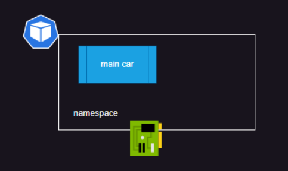
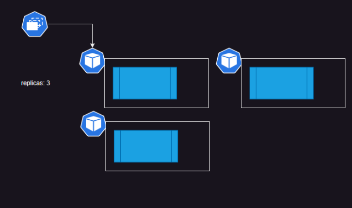
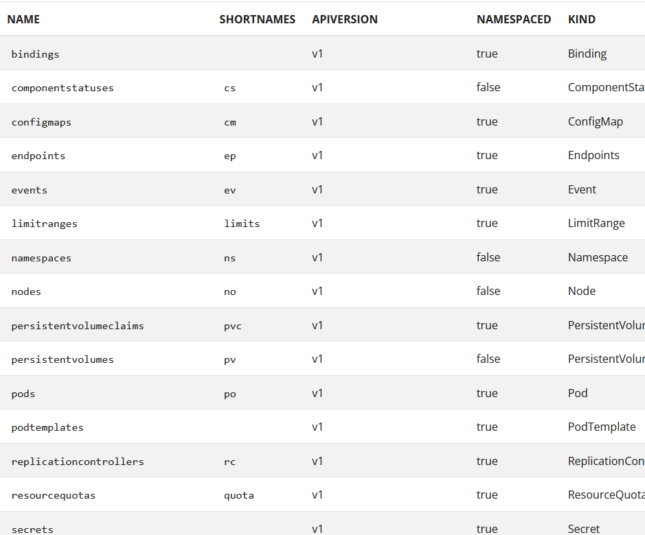
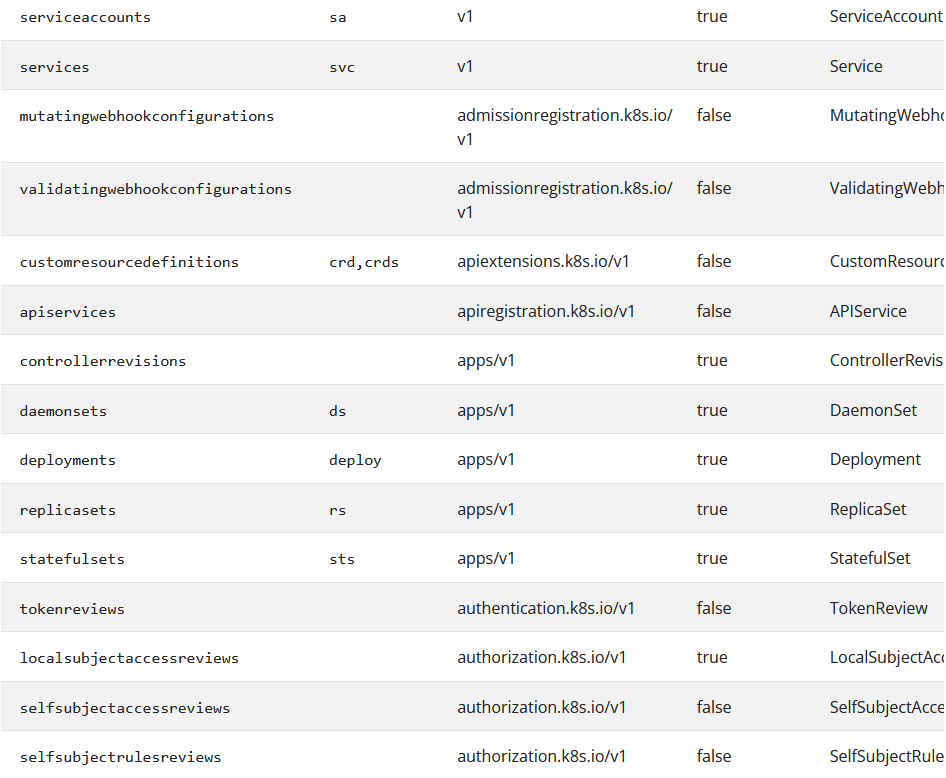
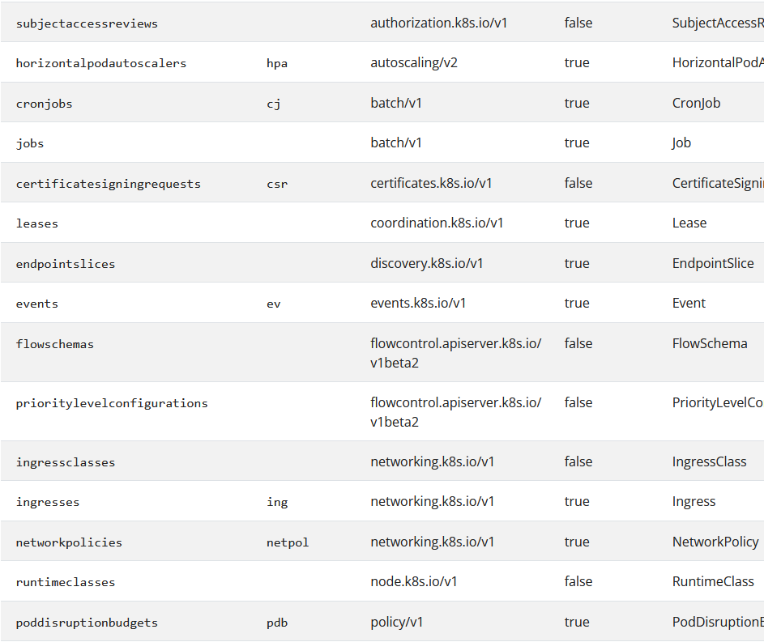
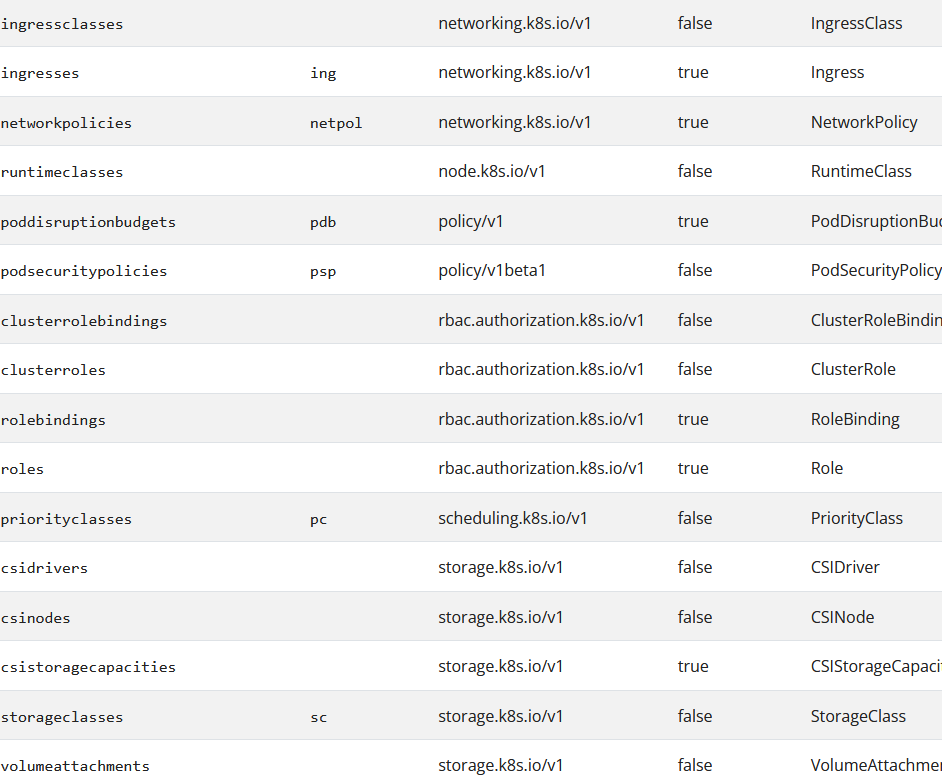

# Kubernetes Major Workloads

# Pod
  
  * Pods are the smallest deployable units of computing that you can create and manage in Kubernetes.
      * Refer here: https://kubernetes.io/docs/concepts/workloads/pods/
  
  * Pods will have one or more containers
  * Each Pod gets an IP Address which is shared to the container(s)
  * Pods will have two types of containers in it    
      * __init containers:__ They are created in a sequence and they are expected to finish in some finite time. Generally we do precondition checks over here.
      
      * __containers:__ These are where we run our application images and they should run forever and they are created in parallel 
  * In Pod the desired state is containers, when containers fail k8s will continuously restart containers
  * There is one more type of container called as ephemeral container which is used for debugging purposes
   
  * Pod yaml file..
   
  ```
  apiVersion: v1
kind: Pod
metadata:
  name: nginx
spec:
  containers:
  - name: nginx
    image: nginx:1.14.2
    ports:
    - containerPort: 80

  ``` 
* kubectl apply -f https://k8s.io/examples/pods/simple-pod.yaml


# Controllers

 * refer here : https://kubernetes.io/docs/concepts/workloads/controllers/replicaset/ 
 
 * __ReplicaSet :__ 
 
 * ReplicaSet creates Pods in the background.
 * A ReplicaSet's purpose is to maintain a stable set of replica Pods running at any given time. Usually, you define a Deployment and let that Deployment manage ReplicaSets automatically.
 
 * A ReplicaSet's purpose is to maintain a stable set of replica Pods running at any given time. As such, it is often used to guarantee the availability of a specified number of identical Pods.  
      
 * You can then get the current ReplicaSets deployed: `kubectl get rs`
 * And see the frontend one you created: 
  
```
NAME       DESIRED   CURRENT   READY   AGE
frontend   3         3         3       6s
```
 * You can also check on the state of the ReplicaSet: `kubectl describe rs/frontend`
 * And lastly you can check for the Pods brought up: `kubectl get pods`  

  


# Deployments

 * refer here: https://kubernetes.io/docs/concepts/workloads/controllers/deployment/
 
 * A Deployment manages a set of Pods to run an application workload, usually one that doesn't maintain state.
 * A Deployment provides declarative updates for Pods and ReplicaSets.
 * You describe a desired state in a Deployment, and the Deployment Controller changes the actual state to the  desired state at a controlled rate. You can define Deployments to create new ReplicaSets, or to remove existing Deployments and adopt all their resources with new Deployments.
 


# DaemonSet

 * refer here: https://kubernetes.io/docs/concepts/workloads/controllers/daemonset/
 
 * This will create a pod on every node (or selected nodes) in k8s cluster
 * A DaemonSet defines Pods that provide node-local facilities. These might be fundamental to the operation of your cluster, such as a networking helper tool, or be part of an add-on.
 * A DaemonSet ensures that all (or some) Nodes run a copy of a Pod. As nodes are added to the cluster, Pods are added to them. As nodes are removed from the cluster, those Pods are garbage collected. Deleting a DaemonSet will clean up the Pods it created.
 * Some typical uses of a DaemonSet are:
   
   * running a cluster storage daemon on every node
   * running a logs collection daemon on every node
   * running a node monitoring daemon on every node
 
 * In a simple case, one DaemonSet, covering all nodes, would be used for each type of daemon. A more complex setup might use multiple DaemonSets for a single type of daemon, but with different flags and/or different memory and cpu requests for different hardware types.  

# StatefulSets

 * refer here: https://kubernetes.io/docs/concepts/workloads/controllers/statefulset/
 
 * StatefulSets are used to run stateful applications and they have capability to manage volumes as well
 * StatefulSet is the workload API object used to manage stateful applications.
 * A StatefulSet runs a group of Pods, and maintains a sticky identity for each of those Pods. This is useful for managing applications that need persistent storage or a stable, unique network identity.
 * Manages the deployment and scaling of a set of Pods, and provides guarantees about the ordering and uniqueness of these Pods.
 
 * __Using StatefulSets__ 
  
   * StatefulSets are valuable for applications that require one or more of the following.
     * Stable, unique network identifiers.
     * Stable, persistent storage.
     * Ordered, graceful deployment and scaling.
     * Ordered, automated rolling updates.   

# Labels and Selectors
  
  * refer here: https://kubernetes.io/docs/concepts/overview/working-with-objects/labels/
  
  * this is a key value pair which can be attached to any k8s object
  * k8s can query objects with the help of labels
  * Labels are key/value pairs that are attached to objects such as Pods.
  * Labels are intended to be used to specify identifying attributes of objects that are meaningful and relevant to users, but do not directly imply semantics to the core system.
  * Labels can be used to organize and to select subsets of objects.
  * Labels can be attached to objects at creation time and subsequently added and modified at any time. 
  *  Each object can have a set of key/value labels defined. Each Key must be unique for a given object.

```
"metadata": {
  "labels": {
    "key1" : "value1",
    "key2" : "value2"
  }
}


--- 

apiVersion: v1
kind: Pod
metadata:
  name: label-demo
  labels:
    environment: production
    app: nginx
spec:
  containers:
  - name: nginx
    image: nginx:1.14.2
    ports:
    - containerPort: 80
```

# Service

 * refer here: https://kubernetes.io/docs/concepts/services-networking/service/
 
 * Expose an application running in your cluster behind a single outward-facing endpoint, even when the workload is split across multiple backends.
 * In Kubernetes, a Service is a method for exposing a network application that is running as one or more Pods in your cluster.
 * __Services in Kubernetes :__

     * A Service is an object (the same way that a Pod or a ConfigMap is an object). You can create, view or modify Service definitions using the Kubernetes API. Usually you use a tool such as kubectl to make those API calls for you. 
     * For example, suppose you have a set of Pods that each listen on TCP port 9376 and are labelled as app.kubernetes.io/name=MyApp. You can define a Service to publish that TCP listener:
      
     * The Service API, part of Kubernetes, is an abstraction to help you expose groups of Pods over a network. Each Service object defines a logical set of endpoints (usually these endpoints are Pods) along with a policy about how to make those pods accessible.
```
apiVersion: v1
kind: Service
metadata:
  name: my-service
spec:
  selector:
    app.kubernetes.io/name: MyApp
  ports:
    - protocol: TCP
      port: 80
      targetPort: 9376

```

# Kubernetes API Server and Clients
 
 * Refer Here: https://kubernetes.io/docs/reference/kubectl/
 * kubectl uses `config` in `~/.kube/config` to get the cluster information and secrets to connect with api server 
 
 * __Command line tool (kubectl)__
   
   * Kubernetes provides a command line tool for communicating with a Kubernetes cluster's control plane, using the Kubernetes API.
   * This tool is named kubectl.
   * For configuration, kubectl looks for a file named config in the $HOME/.kube directory. You can specify other kubeconfig files by setting the KUBECONFIG environment variable or by setting the --kubeconfig flag.
   
   * __Syntax__
     
     * Use the following syntax to run kubectl commands from your terminal window:
     
     * kubectl [command] [TYPE] [NAME] [flags]
     
     * where command, TYPE, NAME, and flags are:
     
     * command: Specifies the operation that you want to perform on one or more resources, for example create, get, describe, delete.
     
     * TYPE: Specifies the resource type. Resource types are case-insensitive and you can specify the singular, plural, or abbreviated forms. For example, the following commands produce the same output:   

```
kubectl get pod pod1
kubectl get pods pod1
kubectl get po pod1

```

* __Resource types__
 
* The following table includes a list of all the supported resource types and their abbreviated aliases.






* kubectl command line tool cheatsheet
  * Refer Here: https://kubernetes.io/docs/reference/kubectl/quick-reference/
*  kuberentes also provides client libraries in various languages 
  *  Refer Here: https://kubernetes.io/docs/reference/using-api/client-libraries/

* __kubectl has two styles of resource creation__ 
  
  * __imperative:__
           *  we construct a command to create a resource
           * quick and convenient way to perform one time or infrequent operations. 
  
  * __declarative:__
           * We write a manifest in yaml format with our desired state
           * Declarative way is useful for automation, repetition and having history of changes 

 * Kubernetes api versioning scheme 
      * Refer Here: https://kubernetes.io/docs/reference/using-api/#api-versioning
 
 * To group releated resources k8s use apiGroups 
      * Refer Here: https://kubernetes.io/docs/reference/using-api/#api-groups  
 
      * core 
      * apps
      * batch
      * …
 
 * API Version: APIGROUP/version for all groups other than core. For core the APIVERSION = version
 
 * When we are writing manifest we specify (generally) 
      
      * apiVersion: Api version of Resource
      * kind: Type of Resource
      * metadata: name and labels
      * spec: here we define what we want  
 * Once we execute this kuberentes adds the fifth field `status` 