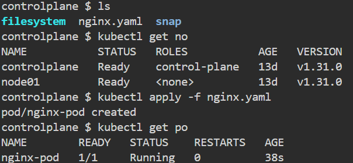
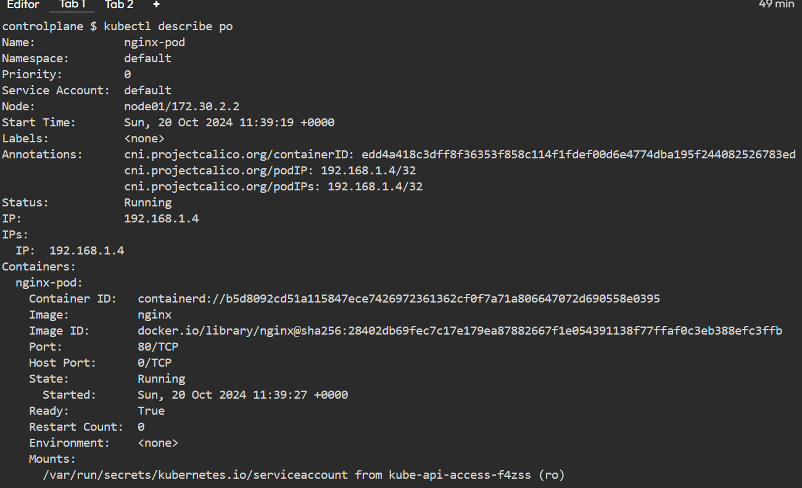
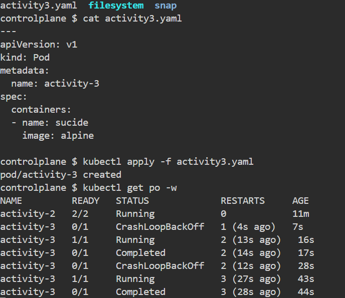
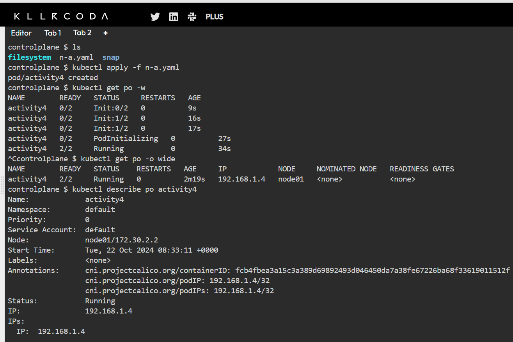
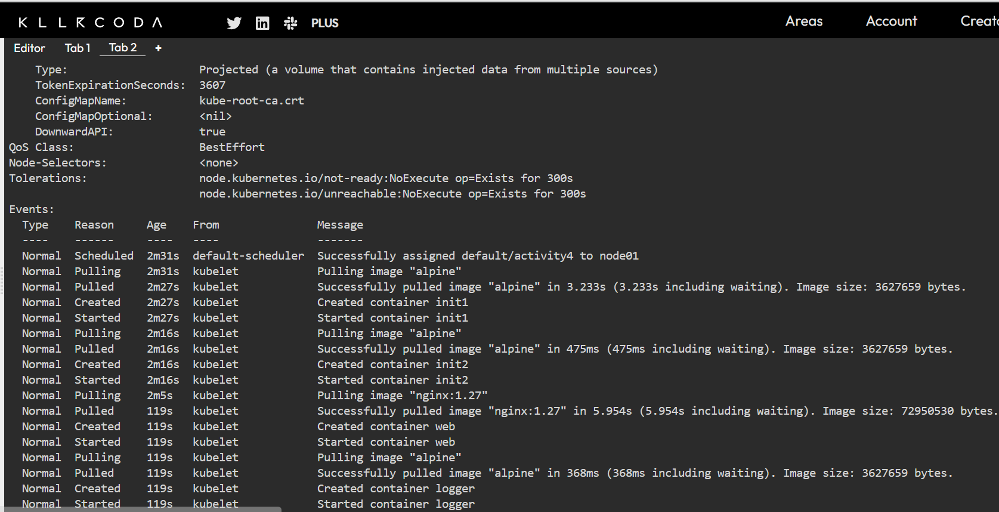
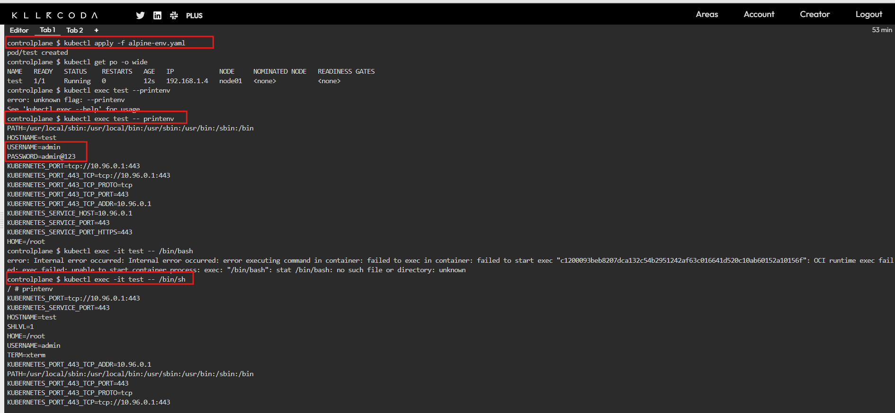
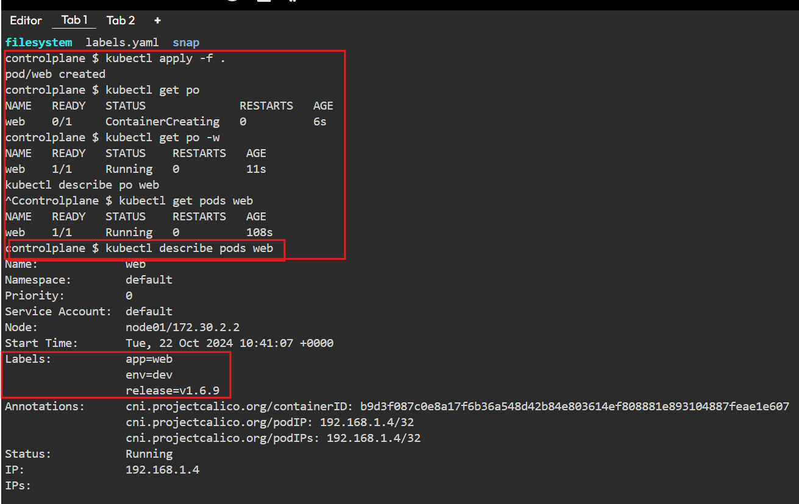
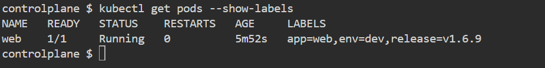

# YAML

* This is data representation format
* YAML uses key value or name value pairs to represent data
* values can be of following types 
   
   * simple/scalar 
      * text
      * number
      * boolean
   
   * complex  
      * list/array
      * map/dictionary/object    
* YAML syntax is heavily inspired from python and json (javascript object notation)
* YAML files will have extension of .yaml or .yml
* yaml basic syntax
```
key: <value>
```

* Sample YAML

```
---
title: "Venom The Last Dance" # Text
year: 2024 # number
budget: 110.5 # number
imaxRelease: yes # boolean
genre: # list
  - Action
  - Adventure
  - Fantasy
  - Sci-Fi
starcast: # object
  Venom: Tom Hardy # Text
  Military Member: Chiwetel Ejiofor # Text
  Scientist: Juno Temple # Text
```

* Writing Kubernetes Manifests
* Kubernetes manifests are strictly structured by api-references
* refer: https://kubernetes.io/docs/reference/
* refer: https://kubernetes.io/docs/reference/generated/kubernetes-api/v1.31/    for 1.31 api reference

# Hello Pod

 * Lets start by writing a pod which will run nginx container
```
---
---
apiVersion: v1
kind: Pod
metadata:
  name: hello-pod
spec:
  containers:
    - name: web
      image: nginx:1.27

---
apiVersion: v1
kind: Pod
metadata:
  name: nginx-pod
spec:
  containers:
    - name: nginx-pod
      image: nginx 
      ports:
        - name: nginx-c
          containerPort: 80
          protocol: "TCP"
```



* To create pods from manifest `kubectl apply -f <filename.yaml>`
* To get basic information `kubectl get pods <pod-name>`
* to get little more info `kubectl get pods <pod-name> -o wide`
* To get detailed information `kubectl describe pods <pod-name>`
* To get podinfo in yaml format `kubectl get pods <pod-name> -o yaml`
* To watch the changes `kubectl get pods -w`

* Create a Pod with two containers
   * pod name activity-2
   * containers: 
     * ngnix
     * alpine with command sleep 1d   
```
---
apiVersion: v1
kind: Pod
metadata:
  name: activity-2
spec:
  containers:
  - name: nginx-c
    image: nginx 
  - name: sidecar
    image: alpine
    args: #cmd
      - sleep
      - 1d

```

# Activity 3: Writing a Pod with a container with exits

* K8s tries restarting pod after crashloopbackoff


```
---
apiVersion: v1
kind: Pod
metadata:
  name: activity-3
spec:
  containers:
  - name: alpine-c
    image: alpine
```

# Init containers 

 * These represent checking for preconditions
 * Init containers always run to completion.
 * Each init container must complete successfully before the next one starts.
 * If a Pod's init container fails, the kubelet repeatedly restarts that init container until it succeeds. However, if the Pod has a restartPolicy of Never, and an init container fails during startup of that Pod, Kubernetes treats the overall Pod as failed.
 * To specify an init container for a Pod, add the `initContainers` field into the Pod specification, as an array of container items (similar to the app containers field and its contents). See Container in the API reference for more details.
 * The status of the init containers is returned in .status.initContainerStatuses field as an array of the container statuses (similar to the .status.containerStatuses field).
 
 * init containers do not support lifecycle, livenessProbe, readinessProbe, or startupProbe whereas sidecar containers support all these probes to control their lifecycle. 

# Differences from regular containers 

 * Init containers support all the fields and features of app containers, including resource limits, volumes, and security settings. However, the resource requests and limits for an init container are handled differently, as documented in Resource sharing within containers.
 
 * Regular init containers (in other words: excluding sidecar containers) do not support the lifecycle, livenessProbe, readinessProbe, or startupProbe fields. Init containers must run to completion before the Pod can be ready; sidecar containers continue running during a Pod's lifetime, and do support some probes. See sidecar container for further details about sidecar containers.

# Differences from sidecar containers 

 * Init containers run and complete their tasks before the main application container starts. Unlike sidecar containers, init containers are not continuously running alongside the main containers.
 
 * Init containers run to completion sequentially, and the main container does not start until all the init containers have successfully completed.
 
 * init containers do not support lifecycle, livenessProbe, readinessProbe, or startupProbe whereas sidecar containers support all these probes to control their lifecycle.

 * Init containers share the same resources (CPU, memory, network) with the main application containers but do not interact directly with them. They can, however, use shared volumes for data exchange.
 
 * This example defines a simple Pod that has two init containers. The first waits for myservice, and the second waits for mydb. Once both init containers complete, the Pod runs the app container from its spec section.  

```
apiVersion: v1
kind: Pod
metadata:
  name: myapp-pod
  labels:
    app.kubernetes.io/name: MyApp
spec:
  containers:
  - name: myapp-container
    image: busybox:1.28
    command: ['sh', '-c', 'echo The app is running! && sleep 3600']
  initContainers:
  - name: init-myservice
    image: busybox:1.28
    command: ['sh', '-c', "until nslookup myservice.$(cat /var/run/secrets/kubernetes.io/serviceaccount/namespace).svc.cluster.local; do echo waiting for myservice; sleep 2; done"]
  - name: init-mydb
    image: busybox:1.28
    command: ['sh', '-c', "until nslookup mydb.$(cat /var/run/secrets/kubernetes.io/serviceaccount/namespace).svc.cluster.local; do echo waiting for mydb; sleep 2; done"]

```

# Activity 4:

 * Lets write a pod spec with nginx and alpine with sleep 1d
 * init containers 
    * init1 alpine with sleep 10s
    * init2 alpine with sleep 10s 
```
---
apiVersion: v1
kind: Pod
metadata:
  name: activity4
spec:
  containers:
    - name: web
      image: nginx:1.27
    - name: alpine-c
      image: alpine
      args:
        - sleep
        - 1d
  initContainers:
    - name: init1
      image: alpine
      args:
        - sleep
        - 10s
    - name: init2
      image: alpine
      args:
        - sleep
        - 10s

```




# Activity 5

 * create a pod with
    * container:
       * name: test
       * image: alpine
       * args: sleep 1d
    * we need to pass the following environmental variables
       * USERNAME = admin
       * PASSWORD = admin@123
   
    * equivalent docker command 
    * `docker run -d --name app1 -P  -e "USERNAME=admin" -e "PASSWORD=admin@123" alpine sleep 1d`

```yaml
---
apiVersion: v1
kind: Pod 
metadata:
  name: test
spec: 
  containers:
    - name: test
      image: alpine
      args:
        - sleep
        - 1d
      env:
        - name: USERNAME 
          value: admin
        - name: PASSWORD
          value: admin@123
```
* commands use
 * `kubectl apply -f alpine-env.yaml` 
    * is used to create or update Kubernetes resources defined in the alpine-env.yaml file.
 *  `kubectl exec test -c <container-name> -- printenv`
 *  `kubectl exec test -- printenv`
     * is used to execute the printenv command inside a Kubernetes pod named test. The printenv command prints out all the environment variables set in the pod’s container.
 
 * `kubectl exec -it test -c <container-name> -- /bin/sh`
 * `kubectl exec -it test -- /bin/sh`  
     * is used to start an interactive shell session inside a running pod in a Kubernetes cluster.`



# Lets start adding labels and Selectors
  
  * refer: https://kubernetes.io/docs/concepts/overview/working-with-objects/labels/
 
  * Labels are key/value pairs that are attached to objects such as Pods.
  * Labels are intended to be used to specify identifying attributes of objects that are meaningful and relevant to users, but do not directly imply semantics to the core system.
  * Labels can be used to organize and to select subsets of objects.
  * Labels can be attached to objects at creation time and subsequently added and modified at any time.
  * Each object can have a set of key/value labels defined.
  * Each Key must be unique for a given object.

* lets create a pod with nginx container and labels
  * env: dev
  * app: web
  * release: v1.6.9

```yaml

apiVersion: v1
kind: Pod
metadata:
  name: web
  labels:
    env: dev
    app: web
    release: v1.6.9
spec:
  containers:
    - name: nginx-c
      image: nginx
```



# Label selectors

  * refer: https://kubernetes.io/docs/concepts/overview/working-with-objects/labels/#label-selectors
  
  * Unlike names and UIDs, labels do not provide uniqueness. In general, we expect many objects to carry the same label(s).
  * Via a label selector, the client/user can identify a set of objects. The label selector is the core grouping primitive in Kubernetes.
  * __The API currently supports two types of selectors: equality-based and set-based.__
  * A label selector can be made of multiple requirements which are comma-separated.
  * In the case of multiple requirements, all must be satisfied so the comma separator acts as a logical AND (&&) operator.

# Equality-based requirement 
  
  * Equality- or inequality-based requirements allow filtering by label keys and values.
  * Matching objects must satisfy all of the specified label constraints, though they may have additional labels as well.
  * Three kinds of operators are admitted =,==,!=. The first two represent equality (and are synonyms), while the latter represents inequality. For example:
  * `environment = production` or `tier != frontend`

# Set-based requirement
  
  * Set-based label requirements allow filtering keys according to a set of values.
  * Three kinds of operators are supported: in,notin and exists (only the key identifier). For example:

```
environment in (production, qa)
tier notin (frontend, backend)
partition
!partition
```
 * The first example selects all resources with key equal to environment and value equal to production or qa
 * The second example selects all resources with key equal to tier and values other than frontend and backend, and all resources with no labels with the tier key.
 * The third example selects all resources including a label with key partition; no values are checked.
 * The fourth example selects all resources without a label with key partition; no values are checked. 

