# Running applications in Pods

 * __spring petclinic__
   
   * This  application is developed in java using spring boot
   * this application runs on port 8080
   * image: `redfiree/spc-project`
   * port: 8080
   *  docker command `docker container run -d --name app1 -P redfiree/spc-project`
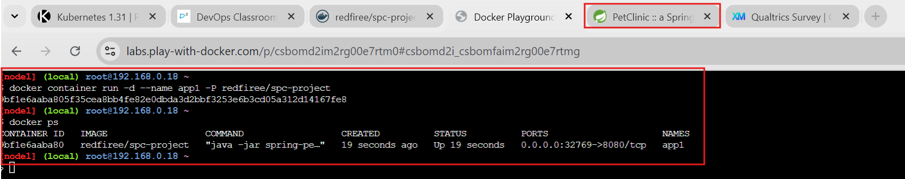
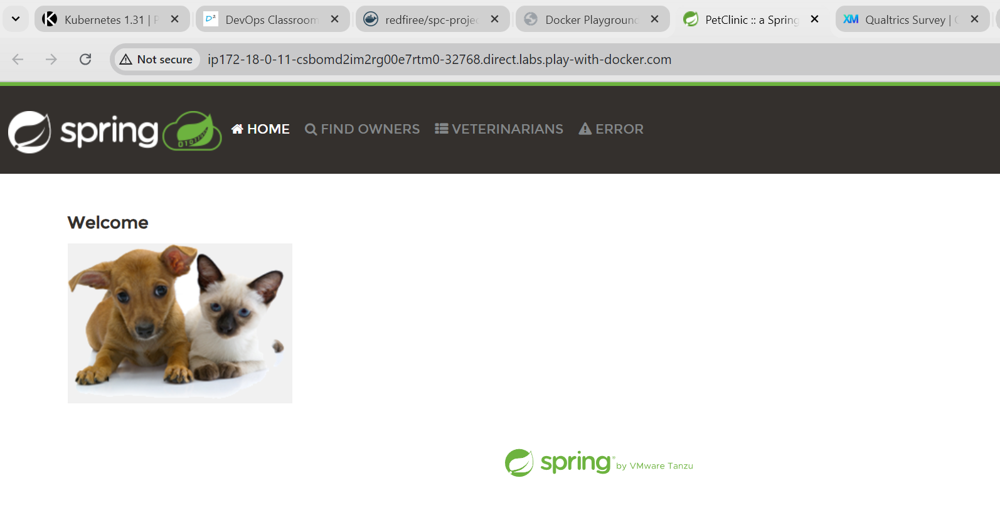
 
 * in k8s for pod specification with port info added 

```yaml
---
apiVersion: v1
kind: Pod
metadata:
  name: spc
  labels:
    app: spc
    version: v5.55
spec:
  containers:
    - name: spc-c
      image: redfiree/spc-project
      ports:
        - name: spc-project 
          containerPort: 8080
          protocol: 
```
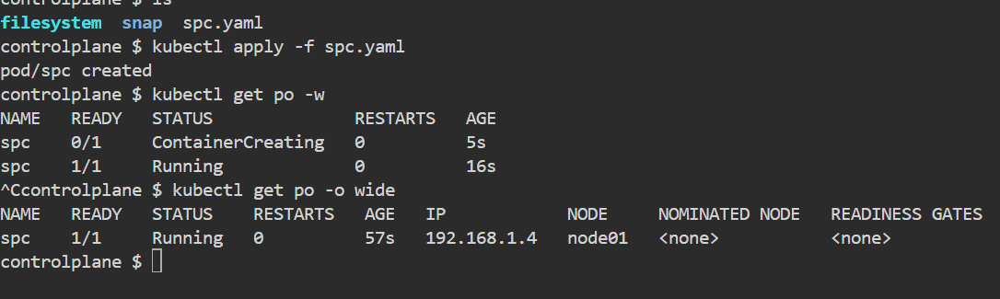

* Note: Exposing Pod directly to external world is not a recommended practice, we are using the following only for evaluation

* Generally while creating containers it is a good idea to define the cpu and memory limits Refer Here: https://directdevops.blog/2019/10/07/docker-logging-docker-memory-cpu-restrictions/#google_vignette for article

* `docker container run -d --name app2 -P --memory "512" --cpu "0.5" redfiree/spc-project` 
* `docker container run --name apps -P -d --cpus="1" --memory 512m redfiree/spc-project`

* Kubernetes also has limits and requests to support allocating upper and lower bound for memory, cpu and other restrictions 
   * Refer Here: https://kubernetes.io/docs/concepts/configuration/manage-resources-containers/

* for the changes done in the specification to include
   * lower limits for cpu and memory
   * upper limits for cpu and memory

```yaml
---
apiVersion: v1
kind: Pod
metadata:
  name: spc
  labels:
    app: spc
    version: v5.55
spec:
  containers:
    - name: spc-build
      images: redfiree/spc-project 
      resources:
        requests:
          memory: "128M"
          cpu: "250m"
        limits: 
          memory: "512M"
          cpu: "1"
      ports:
        - name: spc-c
          containerPort: 8080
          protocol: "TCP"
```

# Label selector 
   
   * Refer Here: https://kubernetes.io/docs/concepts/overview/working-with-objects/labels/#label-selectors 

 * Lets create multiple pods i.e. lets use replicaset 

```yaml

---
apiVersion: apps/v1
kind: ReplicaSet
metadata:
  name: spc-rs
  labels:
    app: spc
    version: v5.55
spec:
  minReadySeconds: 5
  replicas: 2
  selector:
    matchLabels:
      app: spc-build
  template:
    metadata:
      labels:
        app: spc-build 
    spec:
      containers:
        - name: spc-c
          image: redfiree/spc-project
          ports:
            - containerPort: 8080
          resources:
            limits:
              memory: 500Mi
              cpu: 500m 
```
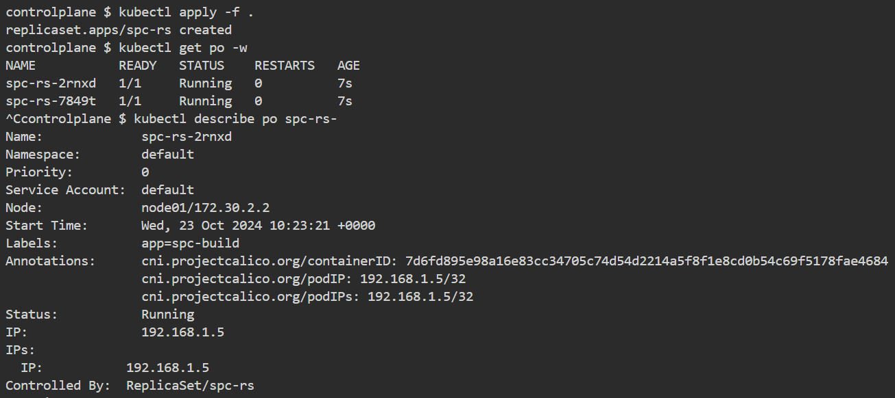
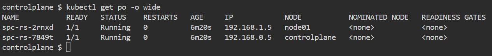
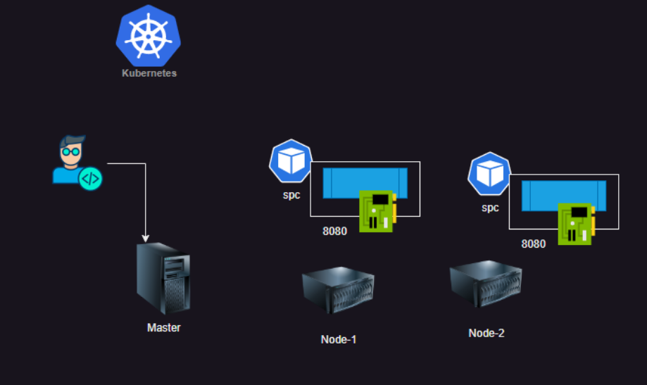

# Service

 * Service is a k8s object which creates a virtual ip address and a DNS Name which is fixed.
 
 * To make this service accessible kube-proxy and CORE DNS will do the job of forwarding/making service accessible
 
 * in every container we have a file /etc/resolve.conf
 
 * Services are of different types
    * Cluster Ip (ip address within k8s cluster)
    * Node Port (Expose service on some port on all nodes of k8s cluster)
    * Load Balancer (Used in Managed k8s clusters)
    * ExternalName (It gives a DNS Record)

 * when we create a service, it creates endpoints, Each endpoint represents a podip with port


 
 * refer: https://kubernetes.io/docs/concepts/services-networking/service/
  
 * Expose an application running in your cluster behind a single outward-facing endpoint, even when the workload is split across multiple backends.
 
 * In Kubernetes, a Service is a method for exposing a network application that is running as one or more Pods in your cluster.
 
 * A Service is an object (the same way that a Pod or a ConfigMap is an object). You can create, view or modify Service definitions using the Kubernetes API. Usually you use a tool such as kubectl to make those API calls for you.


# Services in Kubernetes 

 * The Service API, part of Kubernetes, is an abstraction to help you expose groups of Pods over a network. Each Service object defines a logical set of endpoints (usually these endpoints are Pods) along with a policy about how to make those pods accessible.
 
 * A Service is an object (the same way that a Pod or a ConfigMap is an object). You can create, view or modify Service definitions using the Kubernetes API. Usually you use a tool such as kubectl to make those API calls for you.
 
 * For example, suppose you have a set of Pods that each listen on TCP port 9376 and are labelled as app.kubernetes.io/name=MyApp. You can define a Service to publish that TCP listener:

```yaml

---
apiVersion: v1
kind: Service
metadata:
  name: spc-svc
  labels:
    app: spc
spec:
  type: NodePort
  selector:
    app: spc
    env: dev
  ports:
    - port: 8080
      targetPort: 8080
---
---
apiVersion: apps/v1
kind: ReplicaSet
metadata:
  name: spc-rs
  labels:
    app: spc
spec:
  minReadySeconds: 5
  replicas: 2
  selector:
    matchLabels:
      app: spc
      env: dev
  template:
    metadata:
      labels:
        app: spc
        env: dev
        version: v1.6.9
    spec:
      containers:
        - name: spc
          image: redfiree/spc-project
          ports:
            - containerPort: 8080
          resources:
            request:
              memory: 128Mi
              cpu: 100m
            limits:
              memory: 300Mi
              cpu: 500m
```


* complete yaml file with application and svc file

```yaml
---
apiVersion: apps/v1
kind: ReplicaSet
metadata:
  name: spc-rs
  labels:
    app: spc
    version: v5.55
spec:
  minReadySeconds: 5
  replicas: 2
  selector:
    matchLabels:
      app: spc-build
  template:
    metadata:
      labels:
        app: spc-build 
    spec:
      containers:
        - name: spc-c
          image: redfiree/spc-project
          ports:
            - containerPort: 8080
          resources:
            limits:
              memory: 500Mi
              cpu: 500m  
---
apiVersion: v1
kind: Service
metadata:
  name: spc-svc
spec:   
  type: NodePort
  selector:
    app: spc-build
  ports:
    - name: spc
      port: 555
      targetPort : 8080
      protocol: TCP


```
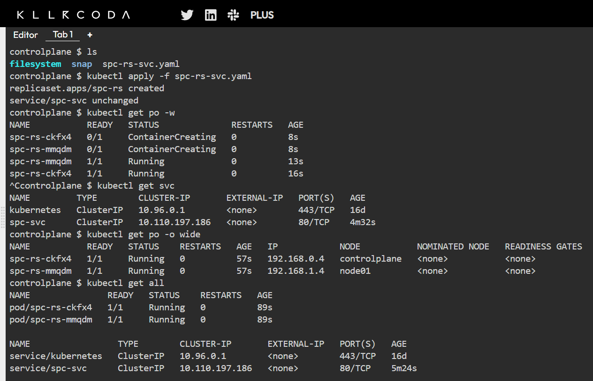
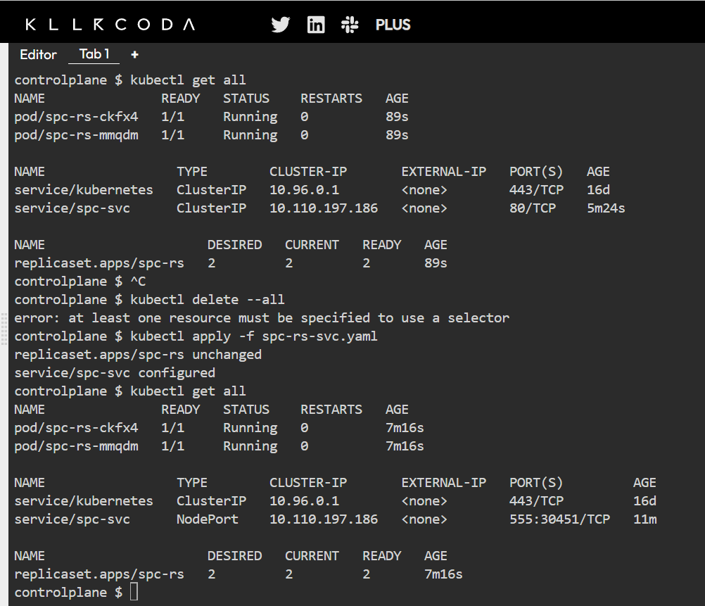
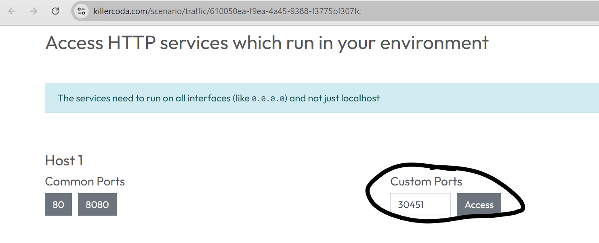
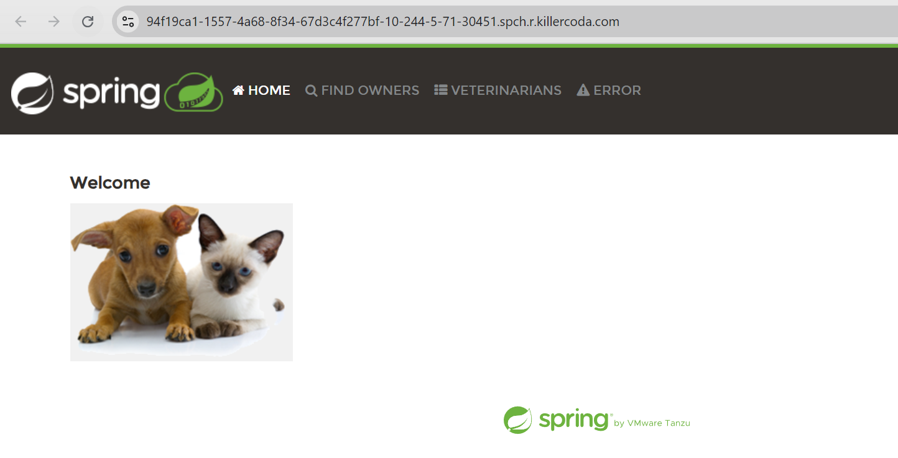

* Overview

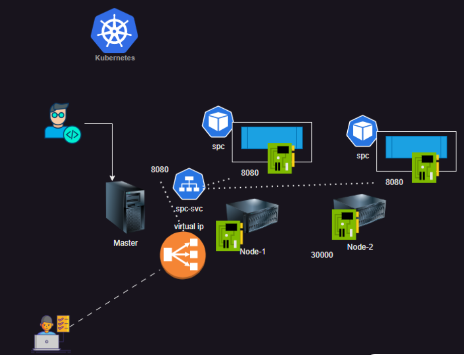