# Phippy Goes to Zoo
 * refer here: https://www.cncf.io/wp-content/uploads/2020/08/Phippy-Goes-To-The-Zoo.pdf for the story book

Deployments
----------- 

* refer here: https://kubernetes.io/docs/concepts/workloads/controllers/deployment/

* Deployments create Replica sets and replicasets create pods which in turn runs the containers 

* Deployments are suitable for stateless applications

* Deployments come with 2 strategies
  * Recreate
  * RollingUpdates (Default)  

* In Rolling updates 
  * we can rollout new versions 
  * undo rollout (rollbacks)

To understand Deployments 
-------------------------

* Lets use image `redfiree/deploy_slash_test:1.0`
* Application runs of `/app` on port 80
* tag 1.0
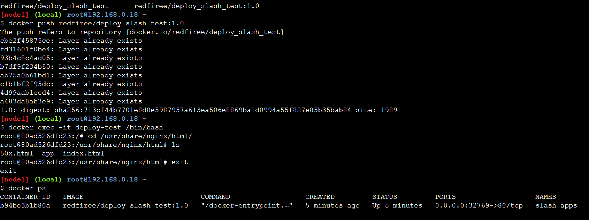
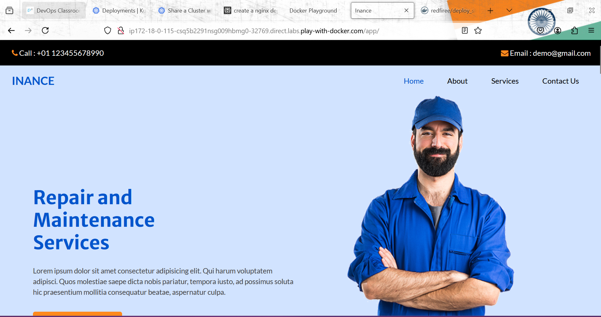

* tag 2.0


* tag 3.0


*  Lets create a Deployment with 4 replicas of version 1.0 with a service exposed to external world 
```yaml
---
apiVersion: apps/v1
kind: Deployment
metadata: 
  name: apps-deploy
spec:
  minReadySeconds: 5
  replicas: 4
  selector:
    matchLabels: 
      app: web
  strategy: 
    type: RollingUpdate
    rollingUpdate: 
      maxSurge: 25%
      maxUnavailable: 25%
  template:
    metadata: 
      labels:
        app: web 
        version: v1.0 
    spec:
      containers:
        - name: web    
          image: redfiree/deploy_slash_test:1.0 
          ports:
            - containerPort: 80
          resources:
            requests:
              memory: 64Mi
              cpu: 125m
            limits:
              memory: 256Mi
              cpu: 250m 

---
apiVersion: v1
kind: Service
metadata:
  name: web-svc
spec:
  type: NodePort
  selector:
    app: web 
  ports:
  - port: 80
    targetPort: 80

```
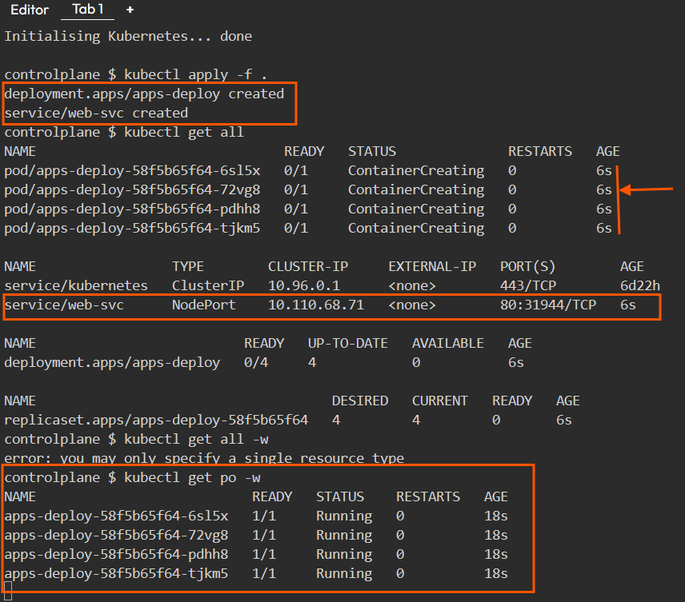

* # kubernetes.io/change-cause
```
Type: Annotation

Example: kubernetes.io/change-cause: "kubectl edit --record deployment foo"

Used on: All Objects

This annotation is a best guess at why something was changed.

It is populated when adding --record to a kubectl command that may change an object
```

* For deployment to record the change cause lets use the annotation 
  * refer here: https://kubernetes.io/docs/reference/labels-annotations-taints/#change-cause

* for changes done to add change cause
  
```yaml
---
apiVersion: apps/v1
kind: Deployment
metadata: 
  name: apps-deploy
  annotations:
    kubernetes.io/change-cause: "version v1.0"
spec:
  minReadySeconds: 5
  replicas: 4
  selector:
    matchLabels: 
      app: web
  strategy: 
    type: RollingUpdate
    rollingUpdate: 
      maxSurge: 25%
      maxUnavailable: 25%
  template:
    metadata: 
      labels:
        app: web 
        version: v1.0 
    spec:
      containers:
        - name: web    
          image: redfiree/deploy_slash_test:1.0 
          ports:
            - containerPort: 80
          resources:
            requests:
              memory: 64Mi
              cpu: 125m
            limits:
              memory: 256Mi
              cpu: 250m 

---
apiVersion: v1
kind: Service
metadata:
  name: web-svc
spec:
  selector:
    app: web 
  ports:
  - port: 80
    targetPort: 80
``` 
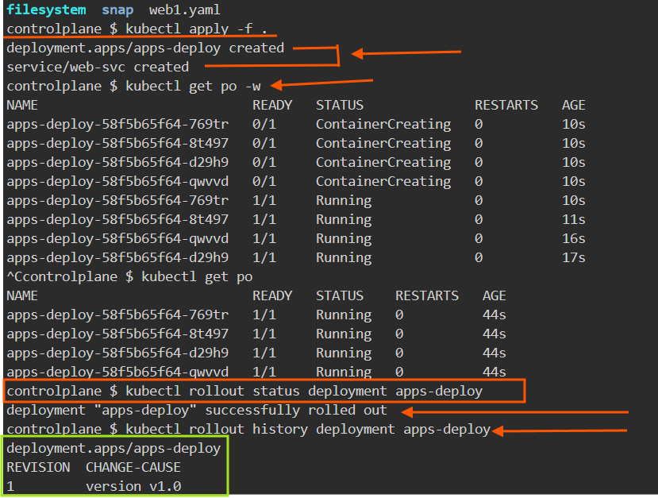

* v2.0
```
---
apiVersion: apps/v1
kind: Deployment
metadata: 
  name: apps-deploy
  annotations:
    kubernetes.io/change-cause: "version v2.0"
spec:
  minReadySeconds: 5
  replicas: 4
  selector:
    matchLabels: 
      app: web
  strategy: 
    type: RollingUpdate
    rollingUpdate: 
      maxSurge: 25%
      maxUnavailable: 25%
  template:
    metadata: 
      labels:
        app: web 
        version: v2.0 
    spec:
      containers:
        - name: web    
          image: redfiree/deploy_slash_test:2.0 
          ports:
            - containerPort: 80
          resources:
            requests:
              memory: 64Mi
              cpu: 125m
            limits:
              memory: 256Mi
              cpu: 250m 

---
apiVersion: v1
kind: Service
metadata:
  name: web-svc
spec:
  selector:
    app: web 
  ports:
  - port: 80
    targetPort: 80
```
* v3.0
```
---
apiVersion: apps/v1
kind: Deployment
metadata: 
  name: apps-deploy
  annotations:
    kubernetes.io/change-cause: "version v3.0"
spec:
  minReadySeconds: 5
  replicas: 4
  selector:
    matchLabels: 
      app: web
  strategy: 
    type: RollingUpdate
    rollingUpdate: 
      maxSurge: 25%
      maxUnavailable: 25%
  template:
    metadata: 
      labels:
        app: web 
        version: v3.0 
    spec:
      containers:
        - name: web    
          image: redfiree/deploy_slash_test:3.0 
          ports:
            - containerPort: 80
          resources:
            requests:
              memory: 64Mi
              cpu: 125m
            limits:
              memory: 256Mi
              cpu: 250m 

---
apiVersion: v1
kind: Service
metadata:
  name: web-svc
spec:
  selector:
    app: web 
  ports:
  - port: 80
    targetPort: 80
```
* To find the deployment status we use `kubeclt rollout `

* To access the application externally use `nodeport` or `loadbalancer` 

* To deploy the new version change the tag and change cause annotation

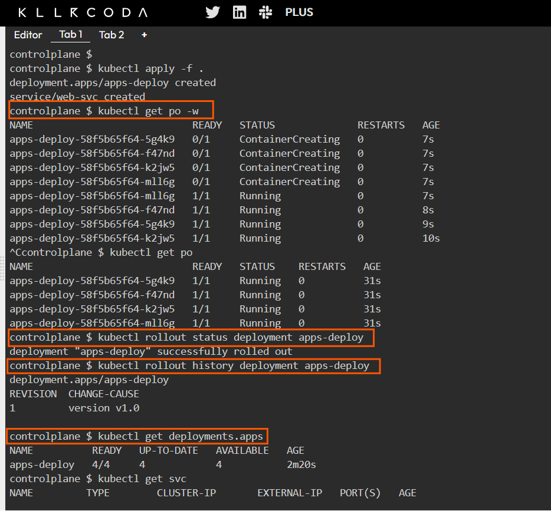

* `kubectl get po -w` is used in Kubernetes to watch the status of pods in real-time. 

* `kubectl rollout status deployment apps-deploy` is used in Kubernetes to monitor the progress of a deployment rollout. 

* `kubectl rollout history deployment apps-deploy` is used in Kubernetes to view the revision history of a specific deployment.This command provides valuable insights into the changes made to the deployment over time, allowing operators and developers to track the evolution of their applications.

* `kubectl get deployments.apps` is used in Kubernetes to list all deployments within the current namespace, providing an overview of the deployment resources managed by Kubernetes.

* ```
  NAME               READY   UP-TO-DATE   AVAILABLE   AGE
  nginx-deployment   3/3     3            3           5m
  my-app             2/2     2            2           10m
  ```
  * Namespace Specification: If you want to list deployments in a specific namespace, you can add the --namespace flag:
  * `kubectl get deployments.apps --namespace=my-namespace `

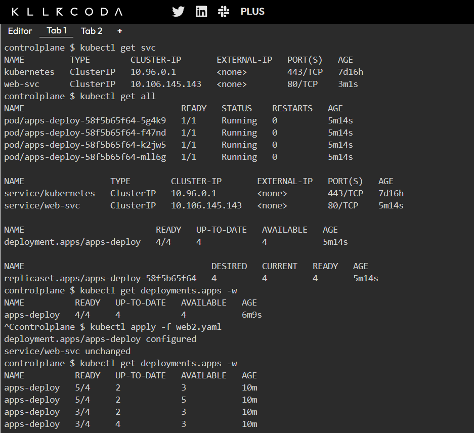

* `kubectl get deployments.apps -w` is used in Kubernetes to watch the status of all deployments in real-time within the current namespace. 
  * ```
    REVISION  CHANGE-CAUSE
    1         kubectl apply --filename=deployment-v1.yaml
    2         kubectl set image deployment/apps-deploy app=myapp:v2
    3         kubectl set image deployment/apps-deploy app=myapp:v3

    ```
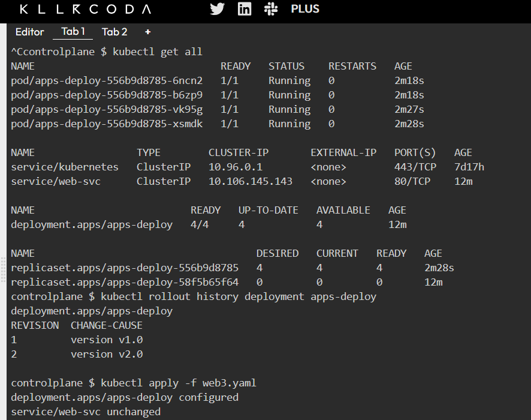
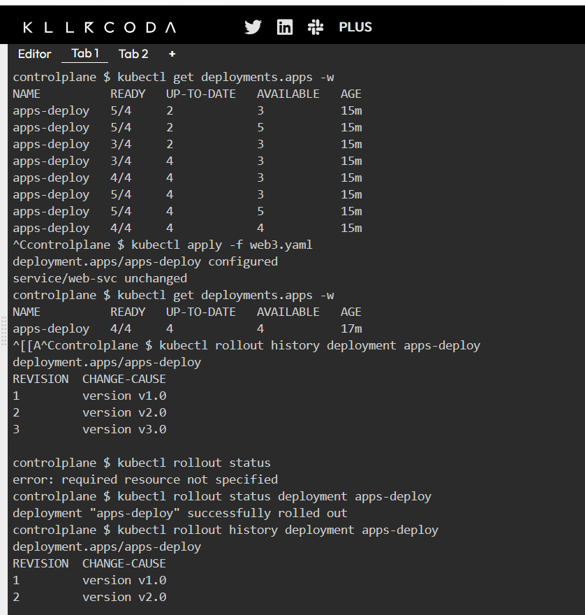
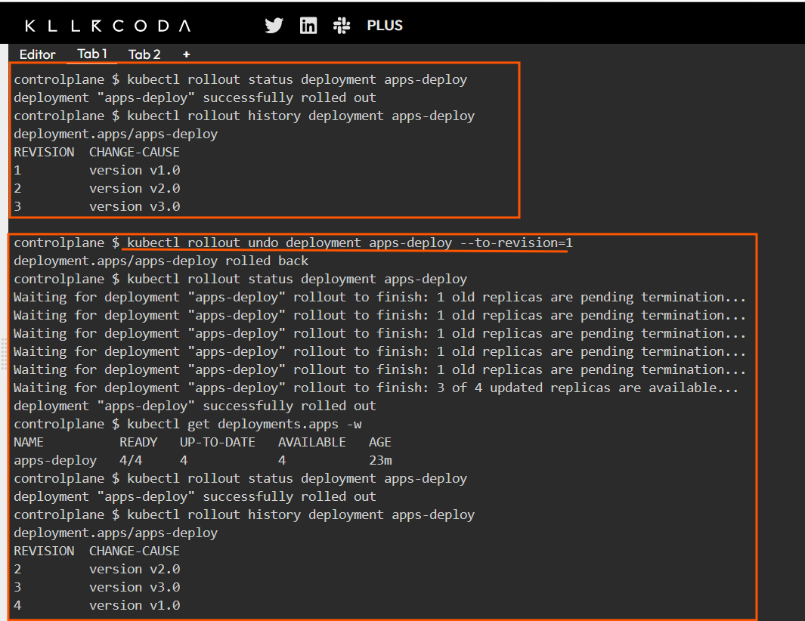

* `kubectl rollout undo deployment apps-deploy --to-revision=1` is used in Kubernetes to revert the specified deployment (apps-deploy) back to a previous revision, specifically revision 1. This command is part of the rollout management capabilities provided by Kubernetes, allowing users to handle issues that may arise from recent deployments.


* When using this command, if revision 1 exists and is valid, the deployment will be reverted successfully, and you can verify this by checking the status of the deployment afterward: `kubectl rollout status deployment apps-deploy`
*  If revision 1 does not exist, you would see an error message like: 
   * `error: unable to find specified revision 1 in history`  

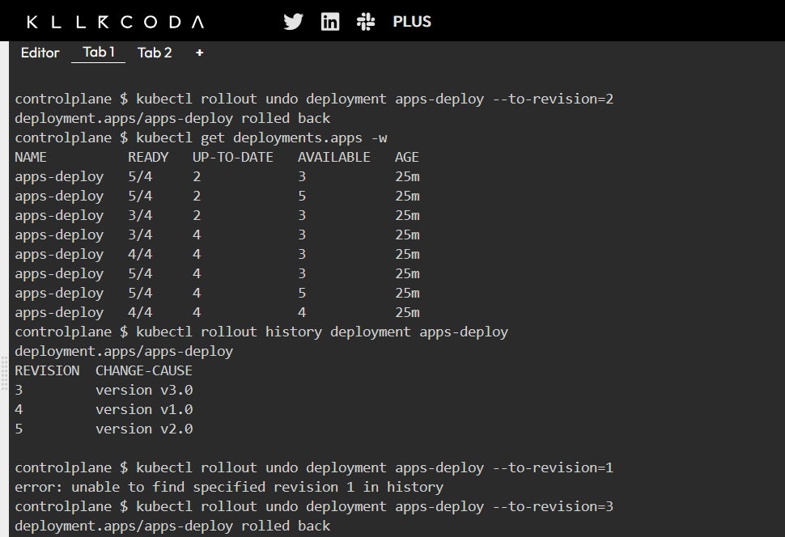
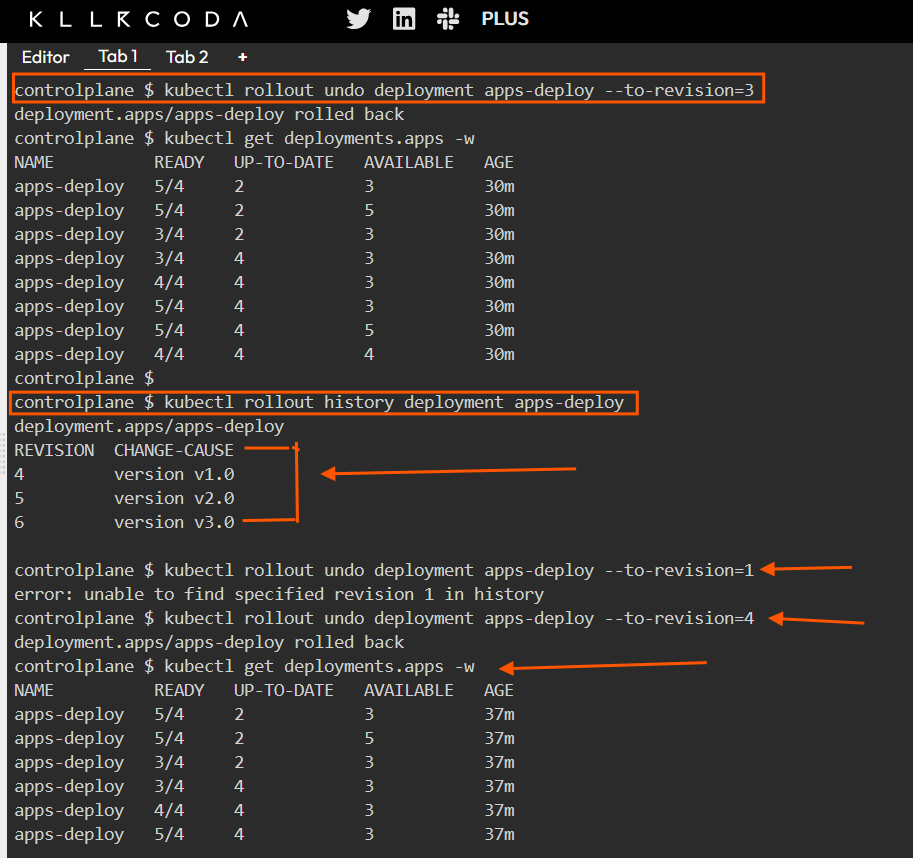

# Importance of Rollbacks

*  Stability: Rollbacks are essential for maintaining application stability. If a new version introduces bugs or performance issues, being able to quickly revert to a previous version minimizes downtime and user impact. 
*  Operational Flexibility: The ability to roll back deployments allows teams to experiment with new features or updates without the fear of permanent disruption, as they can quickly return to a known good state if needed. 
*  Change Tracking: Understanding what changes were made in each revision (using kubectl rollout history deployment apps-deploy) helps teams make informed decisions about when and how to roll back. 
*  The kubectl rollout undo command is a powerful tool in Kubernetes for managing application deployments. By allowing users to revert to previous versions easily, it enhances operational resilience and supports effective application lifecycle management. For successful rollbacks, ensure that the target revision exists in the deployment's history and be prepared for potential errors if it does not.

* Exercise: 
  * Convert 
    * users-service from replicaset to deployment
    * books-service from replicaset to deployment
    * library-web-store from replicaset to deployment   


# Annotations
  * refer here: https://kubernetes.io/docs/concepts/overview/working-with-objects/annotations/
  
  * to communicate with additional data generally purpose for tools.
  
  * so this annotation will be used by cloud controller manager to bassically tell to Azure saying that you have to create a Loadbalancer ensure that Loadbalancer is internal. So the purpose of Annotation is this. 
  
  * if looks logically `Annotations is key = value pair and Labels is also key=value pairs` but the purpuse and motive is different, we cannot use Annotations to filter resourceses so similarly Labels cannot use to communicate with to the 3rd party
  * Annotations add metadata to objects which are generally used by tools 

--------------------------------------------------------------------------------------------------------------------
Q=?


* how to create internal loadbalancer from kubernetes service in Azure AKS?
* generally we will get some question in interviews ``if i want to create different type of loadbalancer how will you do it? in Azure we have 3 Loadbalncer out of which i want to select 1 Loadbalancer how can we change it k8s ? whenever you want to do any such things it is always a = Annotations`` 
* k8s deployment Annotations ?
