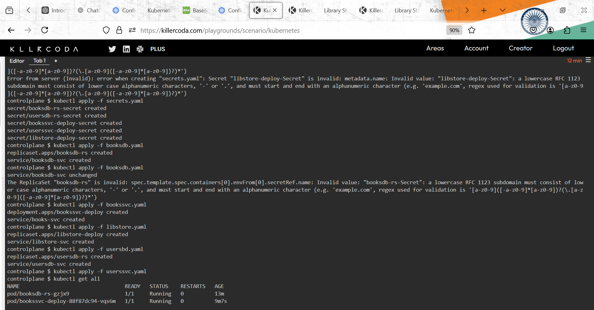
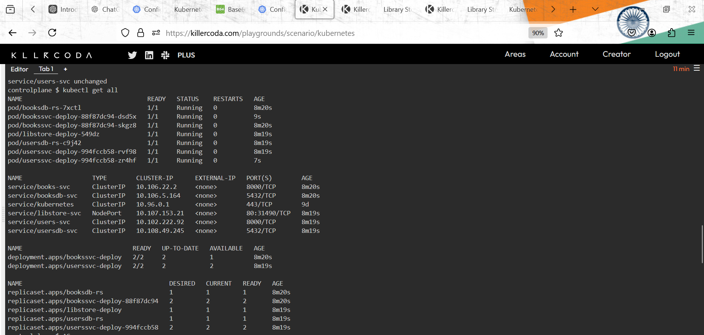
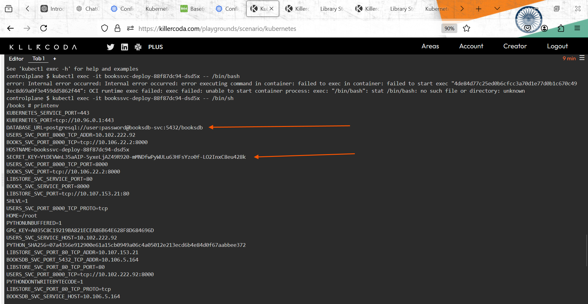
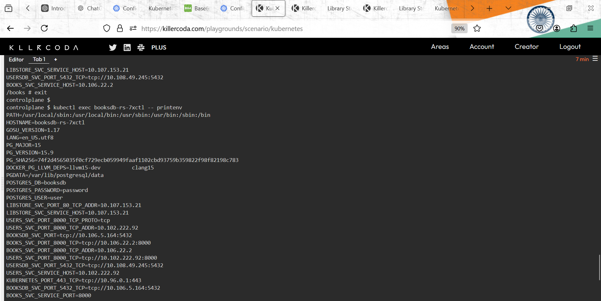

# ConfigMaps and Secrets                                 23/Oct/2024
 
 * refer: https://kubernetes.io/docs/concepts/configuration/configmap/

 * There are four different ways that you can use a ConfigMap to configure a container inside a Pod:

1. Inside a container command and args

2. Environment variables for a container

3. Add a file in read-only volume, for the application to read

4. Write code to run inside the Pod that uses the Kubernetes API to read a ConfigMap


 * A ConfigMap is an API object used to store non-confidential data in key-value pairs.Pods can consume ConfigMaps as environment variables, command-line arguments, or as configuration files in a volume.
 
 * A ConfigMap allows you to decouple environment-specific configuration from your container images, so that your applications are easily portable.
 
 * A ConfigMap in Kubernetes stores configuration settings separately from your application code, making it easier to run the same app in different environments (like development or production) without changing the code. or In short, a ConfigMap makes it easier to manage settings and configurations for your application without changing its core code, which helps in moving your application between different environments smoothly.  

 * Config maps gives us flexibility to separate configuration from Pod. 
 
 * The sensitive information is still in plain text, To solve this Secrets for k8s gives an base64encoding based approach to store sensitive information 
 
 * if you want all the values then choose `envFrom` 
 * if you want to select a particular/values then choose `valueFrom`
 
* There are four different ways that you can use a ConfigMap to configure a container inside a Pod:

  * 1.Inside a container command and args
    * You can inject values from a ConfigMap into a container's `command` and `args` fields, which are the entrypoint and arguments passed to the container when it starts. 
    * Example:
       * Let's say you have a ConfigMap called my-config with a key-value pair like this: 
  ```yaml
  apiVersion: v1
  kind: ConfigMap
  metadata:
    name: my-config
  data:
    myAppConfig: "some_config_value"
  
  # or      

  apiVersion: v1
  kind: Pod
  metadata:
    name: mypod
  spec:
   containers:
    - name: my-container
      image: my-app-image
      command: ["/bin/sh", "-c"]
      args: ["echo $(MY_APP_CONFIG) && exec /myapp"]
      env:
        - name: MY_APP_CONFIG
          valueFrom:
            configMapKeyRef:
              name: my-config
              key: myAppConfig
  
  ``` 
  
* 2.Environment variables for a container
  
  * You can use a ConfigMap to set environment variables in your container. This way , your application can read configuration values from environment variables.
  
```yaml 
apiVersion: v1
kind: Pod
metadata:
  name: mypod
spec:
  containers:
    - name: my-container
      image: my-app-image
      env:
        - name: DATABASE_URL
          valueFrom:
            configMapKeyRef:
              name: my-config
              key: database_url
        - name: API_KEY
          valueFrom:
            configMapKeyRef:
              name: my-config
              key: api_key

# In this example, DATABASE_URL and API_KEY will be available as environment variables inside the container.

```

* 3. Add a file in read-only volume, for the application to read
   
   * You can mount the ConfigMap as a file in a volume so that your application can read it directly from the file system. The volume can be read-only.
  
   * Example
  
     * Let's assume you have the following ConfigMap:  

```yaml
apiVersion: v1
kind: ConfigMap
metadata:
  name: my-config
data:
  config.yaml: 
    database:
      host: db.example.com
      port: 3306
# or 

apiVersion: v1
kind: Pod
metadata:
  name: mypod
spec:
  containers:
    - name: my-container
      image: my-app-image
      volumeMounts:
        - name: config-volume
          mountPath: /etc/myapp/config.yaml
          subPath: config.yaml
  volumes:
    - name: config-volume
      configMap:
        name: my-config
        items:
          - key: config.yaml
            path: config.yaml

# In this example, the config.yaml file will be available in the container at /etc/myapp/config.yaml as a read-only file.


```
# commands

```
kubectl exec user-db-rs-z9r38 --printenv 
kubectl exec books-db-rs-f59br4 --printenv 
```

* 4.Write code to run inside the Pod that uses the Kubernetes API to read a ConfigMap 
  * If you think you will always changes `Configmap` continuously this is something which developers have to implement   
 
 * You can write custom code inside your Pod that uses the Kubernetes API to read a ConfigMap and dynamically update the application behavior. This is typically done using a Kubernetes client in your application (such as the Go client or Python client).
 
 * Example using Python:
   * Install the Kubernetes Python client: `pip install kubernetes`
   
   * Here's a simple example of Python code that reads a ConfigMap from the Kubernetes API:

```
from kubernetes import client, config

def get_configmap():
    # Load kubeconfig (or use in-cluster config)
    config.load_incluster_config()

    v1 = client.CoreV1Api()
    configmap = v1.read_namespaced_config_map(name="my-config", namespace="default")

    # Access values in the ConfigMap
    print(configmap.data["myAppConfig"])

if __name__ == "__main__":
    get_configmap()

```

* To run this code inside the Pod, you would typically package it into your container and then make sure that the Pod has appropriate RBAC (Role-Based Access Control) permissions to access the ConfigMap.

* Example Pod definition with a service account and RBAC permissions:

```yaml
apiVersion: v1
kind: Pod
metadata:
  name: mypod
spec:
  serviceAccountName: my-service-account
  containers:
    - name: my-container
      image: my-app-image
      command: ["python3", "/scripts/read_config.py"]

# In this example, the Python script read_config.py will read the ConfigMap from the Kubernetes API when the container starts.
```

* Command and Args: You can reference ConfigMap values as arguments passed to the container's entrypoint.
* Environment Variables: Map ConfigMap values to environment variables in the container.
* Volume Mount: Mount a ConfigMap as a file in a volume for the container to read.
* Kubernetes API: Write custom code to interact with the Kubernetes API and fetch the ConfigMap directly.


# Secrets 
   
   * Secrets are similar to ConfigMaps but are specifically intended to hold confidential data.  
   * refer: https://kubernetes.io/docs/concepts/configuration/secret/
 
 1.  A Secret is an object that contains a small amount of sensitive data such as a password, a token, or a key. 
 2.  Such information might otherwise be put in a Pod specification or in a container image. 
 3.  Using a Secret means that you don't need to include confidential data in your application code.
 4.  Because Secrets can be created independently of the Pods that use them, there is less risk of the Secret (and its data) being exposed during the workflow of creating, viewing, and editing Pods. Kubernetes, and applications that run in your cluster, can also take additional precautions with Secrets, such as avoiding writing sensitive data to nonvolatile storage.  
 5. The sensitive information is still in plain text, To solve this Secrets for  k8s gives an base64encoding based approach to store sensitive information
 6. The production approach for storing sensitive information will be 
 7. Use an external secrets manager like azure key vault, aws secrets manager, gcp secrets manager or hashicorp vault
 8. Use secrets CSI Driver of a vendor to get the sensitive information into k8s as storage
 9. Secrets `.yaml` files are written in secrets folders. and below i shared images






* # Health Checks or Probes in Kubernetes

   * refer: https://kubernetes.io/docs/tasks/configure-pod-container/configure-liveness-readiness-startup-probes/ 

   * # `Configure Liveness, Readiness and Startup Probes` 
   
   * Kubernetes has various types of probes(probes is not but a check): 

  *  In k8s we have 3 types of Probes 
      * Liveness Probe: 
          * Determines  

1. __Liveness probe__
   
   * Liveness probes are checks that Kubernetes uses to figure out if a container is still working properly. If the container isn't responding or is stuck (for example, because of a deadlock), the liveness probe will detect that and tell Kubernetes to restart the container to fix the issue.
   
   * If a container fails its liveness probe repeatedly, the kubelet restarts the container.
   
   * Liveness probes don’t wait for readiness probes to pass before they start checking the container. So, even if the container isn't ready yet (e.g., still starting up), the liveness probe may begin checking it.
   
   * To give the container some time to start before the liveness probe checks it, you can:
   
     1. Set initialDelaySeconds: This is a delay before the liveness probe starts, giving the container some time to get ready.
     2. Use a startup probe: This is a special kind of probe designed to only check if the container has started. Once it succeeds, the liveness and readiness probes will take over.
   
   * This way, you can avoid the liveness probe acting too soon and potentially restarting the container while it’s still starting up.     

2. __Readiness probe__
     
     * Readiness probes check if a container is ready to start handling traffic. They’re useful when your application needs time to finish important tasks before it can serve requests, like setting up network connections, loading files, or warming up caches.
     
     * In short, readiness probes ensure that Kubernetes doesn’t send traffic to the container until it's fully prepared to handle it. 
     
     * If the readiness probe fails, Kubernetes stops sending traffic to that container by removing it from the list of available endpoints for the service. This means the container won’t receive requests until it passes the readiness check again.

     * Also, readiness probes continue to run throughout the container’s lifecycle, checking periodically to see if the container is ready to accept traffic.

3. __Startup probe__

     * A startup probe verifies whether the application within a container is started.
     
     * A startup probe checks if your application inside a container has fully started. It's useful for slow-starting applications, as it prevents the container from being killed by Kubernetes before it’s actually ready to run.

     * If you use a startup probe, it will disable the liveness and readiness probes until the startup probe passes. This way, Kubernetes won’t perform those checks too early while the application is still starting.

     * Unlike liveness and readiness probes, the startup probe only runs once, just at the beginning, to ensure the container is up and running. After it succeeds, the regular liveness and readiness probes take over.  

# Configure Probes 

  * refer: https://kubernetes.io/docs/tasks/configure-pod-container/configure-liveness-readiness-startup-probes/#configure-probes

 * Probes have a number of fields that you can use to more precisely control the behavior of startup, liveness and readiness checks:

1. __initialDelaySeconds:__
  
  1. This is the time Kubernetes waits after the container starts before it begins checking the health of the container with probes.
  2. If a startup probe is defined, liveness and readiness probes won't start until the startup probe passes.
  3. If `periodSeconds` (how often probes are run) is larger than `initialDelaySeconds`, the `initialDelaySeconds` value is ignored.
  4. Default: 0 seconds (no delay). Minimum value is 0.

2. __periodSeconds:__
  
  1. This controls how often the probe is performed after it starts.
  2. Default: 10 seconds.
  3. Minimum value: 1 second.
  4. For readiness probes, if the container is not ready, Kubernetes may check it more frequently than this interval to make the container ready faster.  

3. __timeoutSeconds:__

  1. This is the amount of time the probe waits for a response before it times out and fails.
  2. Default: 1 second.
  3. Minimum value: 1 second.

4. __successThreshold:__

  1. This is the number of successful probe attempts required for the container to be considered healthy again after a failure.
  2. Default: 1. 
  3. Must be 1 for liveness and startup probes.
  4. Minimum value: 1. 

5. __failureThreshold:__

  1. This defines how many failed attempts in a row are allowed before Kubernetes decides the container is unhealthy and takes action (like restarting it).
  2. Default: 3.
  3. Minimum value: 1.
  4. For liveness and startup probes, if this threshold is reached, Kubernetes will restart the container.
  5. For readiness probes, if it fails, Kubernetes marks the container as not ready but keeps it running. More probes will continue to run.

6. __terminationGracePeriodSeconds:__

  1. This is how long Kubernetes will wait before forcefully shutting down a container after it's been marked for termination.
  2. Default: Inherits the value from the Pod-level terminationGracePeriodSeconds (default is 30 seconds).
  3. Minimum value: 1 second.
  4. This gives the container a grace period to clean up before it is terminated.

# Summary of Key Points:

1. initialDelaySeconds: Delay before probes start after container starts.
2. periodSeconds: How often to check the container health.
3. timeoutSeconds: How long the probe waits before timing out.
4. successThreshold: How many successful probes are needed to consider the container healthy.
5. failureThreshold: How many consecutive failures before Kubernetes considers the container unhealthy.
6. terminationGracePeriodSeconds: Grace period for the container to shut down cleanly before forcefully terminating it.
7. `These settings help control the behavior of probes to better match the needs of your application and container startup/health-check times.`


* Examples

```yaml
---
apiVersion: apps/v1
kind: Deployment
metadata:
  name: bookssvc-deploy
  annotations:
    kubernetes.io/change-cause: "version v1.0"
spec:
  minReadySeconds: 10
  replicas: 1
  selector:
    matchLabels:
      app: books
  template:
    metadata:
      labels:
        app: books 
    spec:
      containers:
        - name: books-svc-c
          image: redfiree/libbookssvc:1.0
          envFrom:
            - secretRef:
                name: bookssvc-deploy-Secret
          ports:
            - containerPort: 8000
          resources:
            requests:
              memory: 128M
              cpu: 125m 
            limits:
              memory: 256M 
              cpu: 250m 
          livenessProbe:
            initialDelaySeconds: 3
            periodSeconds: 10
            successThreshold: 1
            failureThreshold: 3
            tcpSocket:
              port: 8000
          readinessProbe:
            initialDelaySeconds: 5
            periodSeconds: 10
            successThreshold: 1
            failureThreshold: 3
            httpGet:
              path: /docs
              port: 8000
          startupProbe:
            initialDelaySeconds: 2
            periodSeconds: 10
            successThreshold: 1
            failureThreshold: 3
            exec:
              command:
                - /bin/sh
                - -c
                - ps aux | grep uvicorn          
          

---
apiVersion: v1
kind: Service
metadata:
  name: books-svc
spec:
  type: ClusterIP
  selector:
    app: books
  ports:
  - port: 8000
    targetPort: 8000
```

# command to check application is running or not 

```
kubectl get po
kubectl exec -it user-service-rs-z9r38-th6v9 -- /bin/sh

ps aux
ps aux | grep uvicorn
```
# search
  * how could i know my application is running or not or container
  * what causes the failure application according to write probes