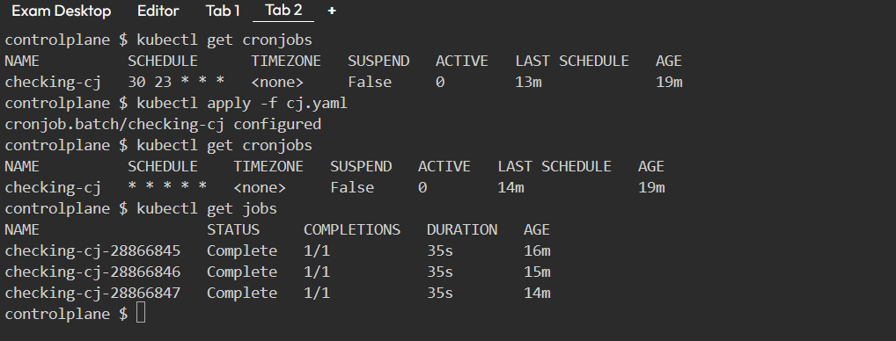
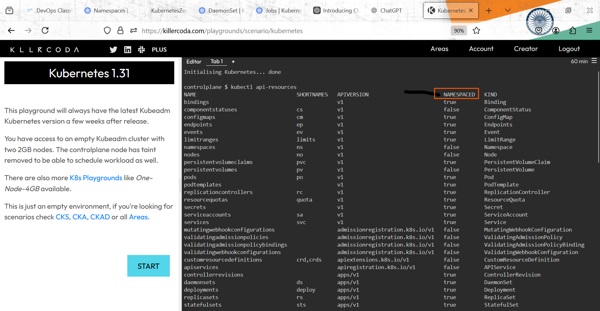

# Daemonsets
 
 * refer: https://kubernetes.io/docs/concepts/workloads/controllers/daemonset/
   
   * Daemonsets are used to run a pod on each node or selected nodes
   * Daemonset support rolling updates like deployments
   * They are useful for running agent like  softwares in container  

* `so if i want to export logs of all nodes to aws cloud watch so on each node i need to have something running which will read those logs and send it to somewhere. so i don't need multiple i need 1 node 1 pod on every node or i need pod on any selected node for this kind of workloads we use Daemonset.` 

* `so on each k8s node we have kubelet so kubelet is a internally Daemonset. `

*  A DaemonSet in Kubernetes ensures that a specific Pod runs on every node in a cluster. It is used for services that need to operate locally on each node, such as: 
   
   *  Monitoring agents (to collect metrics)
   *  Logging services (to gather logs)
   *  Network tools (for local caching or DNS)

* Automatic Deployment: Pods are automatically created on new nodes and removed from deleted nodes.
* Scalability: The number of Pods scales with the number of nodes.
* Customizable: You can control where Pods run using selectors.
* A DaemonSet makes sure that certain tasks or services (like network helpers or monitoring tools) are always running on every node (or specific nodes) in the cluster.

* __Key Features of DaemonSet:__

  1. Node-Local Services: = DaemonSets are typically used for Pods that provide node-local facilities like monitoring, logging, networking, or storage. These services are essential for the operation of the cluster.
  
  2. Automatic Scheduling on New Nodes: = As you add new nodes to the cluster, Kubernetes will automatically schedule the Pod defined in the DaemonSet on those new nodes. Similarly, when nodes are removed, the Pods will be automatically cleaned up (i.e., garbage collected). 
 
  3. Pod Management: = Deleting a DaemonSet will also remove all the Pods it created, ensuring proper cleanup.

# Typical Use Cases for DaemonSet:

*  __Running Cluster Services:__ 
     
     1. Storage Daemon: For distributed storage solutions like Ceph or GlusterFS that require a Pod running on each node.  
     
     2. Logging Daemon: Running log collection agents (e.g., Fluentd, Logstash) on every node to gather logs and send them to a central logging system.
     
     3. Monitoring Daemon: Deploying monitoring agents (e.g., Prometheus, Datadog) on every node to collect metrics and provide monitoring for your cluster.  

4. __Handling Different Hardware Requirements:__ = In more complex setups, you might have multiple DaemonSets for the same type of daemon but with different configurations (e.g., different CPU/memory requests or specific flags for nodes with different hardware).

5. __Why Use DaemonSets?__
    
    1. Consistency Across Nodes: Ensure that important services (like logging or monitoring) are consistently running on all nodes.
    2. Easy Scaling: When new nodes are added, DaemonSets automatically take care of deploying the necessary Pods on those nodes.
    3. Cluster Management: Helps with node-local management tasks (like storage or network configuration) that are critical to the cluster’s operation.

6. __Example of Using DaemonSet:__

    1. You have 3 nodes in your cluster.
    2. You create a DaemonSet for the log collector.
    3. The DaemonSet makes sure the log collector is running on all 3 nodes.
    4. If you add a 4th node, the DaemonSet will automatically start the log collector on that 4th node as well.
    5. This way, you don’t have to manually deploy the log collector on each new node. The DaemonSet does it for you!  
     

# Jobs and CronJobs
  
  * https://kubernetes.io/docs/concepts/workloads/controllers/job/
  * refer: https://kubernetes.io/docs/concepts/workloads/controllers/cron-jobs/

# Jobs: 
 
* `Jobs runs only 1 time `
  * A Job is a Kubernetes resource used for running one-off tasks that need to run to completion. Once the task finishes successfully, the Job stops automatically.
  
  1. Key Points about Jobs: = 
     
     * A Job is used for tasks that run for a specific period and then complete, like processing a batch of data, running a script, or backing up files.
  
  2. Once, Then Stop: 

     * The Job runs once and doesn’t keep running indefinitely. After it finishes, it stops automatically. For example, a Job might run a database backup, and once the backup is done, the Job will stop.  
  
  3. Pod Management:
     
     * The Job automatically creates and manages Pods that perform the task. It ensures that the Pods run to completion, and if a Pod fails, the Job will automatically create new Pods until the task is completed successfully.

  4. Use Cases:

     * Batch processing: Running a task that processes a batch of data.
     * Database backup: Running a one-time backup of a database.
     * Data migration: Moving data from one place to another as a one-time task.
     * Test scripts: Running a script that performs a one-time check or test.  

# Example of a Job:
   
   1. Imagine you need to back up a database
   2. You create a Job in Kubernetes to back up the database.  
   3. The Job starts running a Pod that performs the backup. 
   4. Once the backup is finished, the Job stops and no longer runs.
   
# CronJob

* `Cronjob is which you can schedule , example i want do this job once in a week,month,year or everyday/sunday.`
 *  A cron job is a scheduled task that automates the execution of scripts or commands at specified intervals on Unix-like operating systems. This functionality is similar to setting an alarm clock to perform tasks at certain times, such as daily backups or periodic updates. 
 
 * __Key Components of Cron Jobs:__
     
     1. Cron Job: Represents a single execution instance of a task.  
     2. Job: Defines the logic that will be executed. This is implemented through a class that extends AbstractJobPerformable or implements the JobPerformable interface.
     3. Trigger: Responsible for scheduling when a job should run, using attributes like seconds, minutes, hours, etc., or defined through a cron expression.

* Lets write a cronjob which runs every day at 11:30 PM:

```yaml
---
apiVersion: batch/v1
kind: CronJob
metadata:
  name: checking-cj 
spec:
  schedule: "30 23 * * *"
  jobTemplate: 
    metadata:
      labels:
        app: check-cj
    spec:
      template:
        metadata:
          labels:
            app: check-cj
        spec:
          containers: 
            - name: check-cj-c
              image: alpine
              args:
                - sleep
                - 30s 
          restartPolicy: OnFailure

```
* The schedule changed to * * * * *, meaning it now runs every minute.

```yaml
---
apiVersion: batch/v1
kind: CronJob
metadata:
  name: checking-cj 
spec:
  schedule: "* * * * *"
  jobTemplate: 
    metadata:
      labels:
        app: check-cj
    spec:
      template:
        metadata:
          labels:
            app: check-cj
        spec:
          containers: 
            - name: check-cj-c
              image: alpine
              args:
                - sleep
                - 30s 
          restartPolicy: OnFailure

```


# Why Use Jobs?
   
   1. For tasks that don’t need to run continuously: Jobs are great for tasks that need to run once and finish, such as processing logs or doing a one-time data migration.
   2. Automates retries on failure: If a Pod fails, Kubernetes will retry until the task is completed successfully.


# Namespace

 * refer: https://kubernetes.io/docs/concepts/overview/working-with-objects/namespaces/
 
 * In  kubernetes we have api-resources
 
 * Resources are classified into two scopes
    
    * Namespace scoped resources: 
      * Namespace true indicates namespace scoped resources

    * Cluster scoped resources 
      * Namespaced false indicates cluster scoped resources

    

 * A namespace is a way to organize and isolate different resources (like Pods, Services, Deployments, etc.) within a single Kubernetes cluster.

# Key Points about Namespaces:

  1. # Resource Isolation:

     * Namespaces allow you to group resources together and isolate them from each other. This is useful when you have multiple teams or applications sharing the same cluster, but you want them to work independently.

  2. # Unique Names Within a Namespace:

     * Resources (like Pods or Services) must have unique names within a single namespace. For example, you can have a Pod named frontend in namespace A and another Pod named frontend in namespace B—because the names only need to be unique within the same namespace, not across namespaces.

  3. # Namespace Scoping:

     * Namespaces are used only for namespaced objects, such as:
        
        * Pods
        * Deployments
        * Services
        * ConfigMaps
        * Secrets

     * They do not apply to cluster-wide objects, such as:
     
       * Nodes
       * PersistentVolumes
       * StorageClasses
       * ClusterRoles
  
  4. # Separation of Resources:

       * Namespaces help separate resources for different environments (e.g., dev, staging, prod), teams, or projects within the same cluster.
  
  5. # Default Namespace:

       * Every Kubernetes cluster has a default namespace called default. If you don’t specify a namespace, resources will be placed in the default namespace.

# Use Cases for Namespaces:

   1. Multiple Environments: You can have separate namespaces for development, staging, and production environments within the same cluster, keeping them isolated from each other.
   
   2. Team or Project Isolation: You can create namespaces for different teams or projects so their resources don’t interfere with each other.               
   
   3. Security and Access Control: Namespaces can help with access control (using RBAC) to limit which users or services can access resources in a specific namespace.

# Example:
   
   * You have two applications in your Kubernetes cluster:
     
      1. App A: Running in the development environment.
      2. App B: Running in the production environment.

   * You can create two namespaces, one for each application:
   
      1. namespace: dev for App A
      2. namespace: prod for App B

   * Both apps can have a Service named frontend, but the names are unique within their own namespaces, so there's no conflict.

# How to Create a Namespace:

```yaml
---
apiVersion: v1
kind: Namespace
metadata:
  name: dev
```
* Apply it using kubectl: `kubectl apply -f namespace-dev.yaml`

# Using Namespaces: 
  
  * You can create resources (e.g., Pods, Deployments) in a specific namespace by using the --namespace flag with kubectl: `kubectl create deployment my-app --image=my-image --namespace=dev`

# Exercise 

  * create a qa namespace (use manifest)
```yaml
apiVersion: v1
kind: Namespace
metadata:
  name: qa
  labels:
    environment: qa

```
 
  * create a nginx deployment with 3 replicas in qa namespace

```yaml
---
apiVersion: apps/v1
kind: Deployment
metadata:
  name: nginx-deployment
  namespace: qa
  labels:
    app: nginx
spec:
  replicas: 3
  selector:
    matchLabels:
      app: nginx
  template:
    metadata:
      labels:
        app: nginx
    spec:
      containers:
      - name: nginx
        image: nginx:latest
        ports:
        - containerPort: 80

```
  * create a service with matches the labels in qa namespace

```yaml
apiVersion: v1
kind: Service
metadata:
  name: nginx-service
  namespace: qa
spec:
  selector:
    app: nginx
  ports:
  - protocol: TCP
    port: 80
    targetPort: 80
  type: ClusterIP

```
  * create an alpine pod in default namespace, try pinging to the nginx service in qa namespace with name not ip

```yaml 
---
apiVersion: v1
kind: Pod
metadata:
  name: alpine-pod
  namespace: default
spec:
  containers:
  - name: alpine
    image: alpine:latest
    args:
      - sleep
      - 1d
```
--------------------------------------------------------------------------------------------------------------------

* if exit code is '0' that means its successful if other than '0' like '1' so its failed.

--------------------------------------------------------------------------------------------------------------------