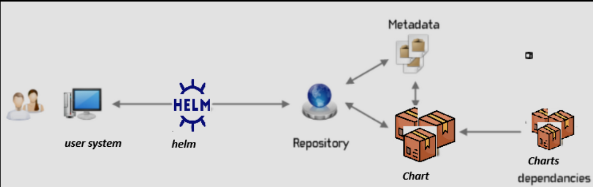
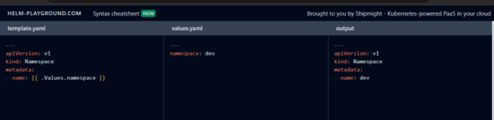

# Ingress and Ingress Controllers

# [Ingress](https://kubernetes.io/docs/concepts/services-networking/ingress/)

# [Ingress Controllers](https://kubernetes.io/docs/concepts/services-networking/ingress-controllers/)

  * Lets look at our apps
    * shaikkhajaibrahim/preschool:1.1:
      * This runs a preshool app on path /preschool on port 80
    
    * shaikkhajaibrahim/skateboard:1.0
      * This runs a skate board app on path /skate on port 80


* Refer Here for the deployment manifest with images and service with clusterip
```yaml

---
apiVersion: apps/v1
kind: Deployment
metadata:
  name: preschool-deploy
spec:
  replicas: 2
  selector:
    matchLabels:
      app: preschool
  template:
    metadata:
      labels:
        app: preschool
    spec:
      containers:
      - name: preschool
        image: shaikkhajaibrahim/preschool:1.1
        resources:
          requests:
            memory: "64Mi"
            cpu: "100m"
          limits:
            memory: "128Mi"
            cpu: "500m"
        ports:
        - containerPort: 80
---
apiVersion: v1
kind: Service
metadata:
  name: preschool-svc
spec:
  selector:
    app: preschool
  ports:
  - port: 80
    targetPort: 80
```

skate.yaml
---------------

```yaml
---
apiVersion: apps/v1
kind: Deployment
metadata:
  name: skate-deploy
spec:
  replicas: 2
  selector:
    matchLabels:
      app: skate
  template:
    metadata:
      labels:
        app: skate
    spec:
      containers:
      - name: skate
        image: shaikkhajaibrahim/skateboard:1.0
        resources:
          requests:
            memory: "64Mi"
            cpu: "100m"
          limits:
            memory: "128Mi"
            cpu: "500m"
        ports:
        - containerPort: 80
---
apiVersion: v1
kind: Service
metadata:
  name: skate-svc
spec:
  selector:
    app: skate
  ports:
  - port: 80
    targetPort: 80
```

* K8s does not have a default ingress implementation, for this exercise lets use nginx ingress controller

* `kubectl apply -f https://raw.githubusercontent.com/kubernetes/ingress-nginx/main/deploy/static/provider/cloud/deploy.yaml`

* Now lets write ingress rules Refer Here: 

```yaml
---
apiVersion: networking.k8s.io/v1
kind: Ingress
metadata:
  name: app-ingress
  annotations:
    nginx.ingress.kubernetes.io/rewrite-target: 
spec:
  ingressClassName: nginx
  rules:
    - http:
        paths:
          - path: /preschool
            pathType: Prefix
            backend:
              service:
                name: preschool-svc
                port: 
                  number: 80
          - path: /skate
            pathType: Prefix
            backend:
              service:
                name: skate-svc
                port: 
                  number: 80
```

# Installing nginx ingress controller

* To install the NGINX Ingress Controller using kubectl, follow these steps:


# CRD (Custom Resource Definitions) & Operators


* Kubernetes gives the extension mechanism where we create
    * CRD (Custom resource definition)
    * Operators: https://sdk.operatorframework.io/
    * They create reconcile loop

* Lifecycle => CRD + Operator

Problem 1: Static YAML Manifests
-------------------------------------

* K8s manifests are static in nature
  
  * Kubernetes manifests are static because:
        * Fixed Instructions: They contain set configurations for resources (like Pods and Services) that don’t change on their own.

        * Manual Updates: If you want to change something, you have to edit the manifest file and apply it again.

        * No Automatic Changes: They don’t adapt or update automatically based on other resources; you need to do it manually.

        * In short, they define what you want, but they stay the same until you change them!

* During deployments we will have changes to handle    
       * image tags
       * labels
       * namespaces
       * We have to manually change the manifests

Problem 2: No Reusability
-----------------------------

* Manifest YAML files are not reusable


Solutions
-----------
    
   1. Helm:
   2. This works as a package manager to kubernetes 
   3. we need to install helm 
   4. Kustomize 
   5. This works as if manages multiple environments 
   6. This work with native kubectl 
   

# Helm

* Helm offical https://helm.sh/ 
* to install helm https://helm.sh/docs/intro/install/

* In helm



* Components:
    * Helm (client)
    * Repository (Which hosts the charts)
    * Chart (An individual package)

* Create a helm chart for basic deployment
    * YAML Manifest

```yaml
---
apiVersion: apps/v1
kind: Deployment
metadata:
  name: nginx-deploy
spec:
  replicas: 2
  selector:
    matchLabels:
      app: nginx
  template:
    metadata:
      labels:
        app: nginx
    spec:
      containers:
      - name: nginx-c
        image: nginx:latest
        resources:
          limits:
            memory: "128Mi"
            cpu: "500m"
        ports:
        - containerPort: 80

---
apiVersion: v1
kind: Service
metadata:
  name: nginx-svc
spec:
  type: ClusterIP
  selector:
    app: nginx 
  ports:
  - port: 80
    targetPort: 80

```

# Helm Charts

* Lets create a helm chart

  * helm create activity1
  * A folder called as activity1 is create with following content


* Refer Here for official docs on Charts : https://helm.sh/docs/topics/charts/

* Helm use go templating syntax Refer Here: https://helm.sh/docs/chart_template_guide/

* Use helm online validator to verify expression Refer Here: https://helm-playground.com/#t=LQhQFMA8EMFsAcA24BcACA3h4aB0A1aRAV3AGdcBLAF3FjLQB81qB7ATTkSbQDtLeAE3C9qaAExoAvlNBA&v=LQhQEsBcFMFsGcBcACA2gIgGbgE70ugDTLrzQDGA9gHYAm6AuqEA

* Helm creates manifests and passes it to the kubectl after replacing dynamic expression (template expressions)



* Refer Here for synaxes used in Helm : https://helm-playground.com/cheatsheet.html

* Refer Here: https://github.com/asquarezone/KubernetesZone/commit/6e46af8af09223c7589d7475f20c3bdc4b10f030 for the helm chart.

* Now create a chart repository and push the chart to repository


