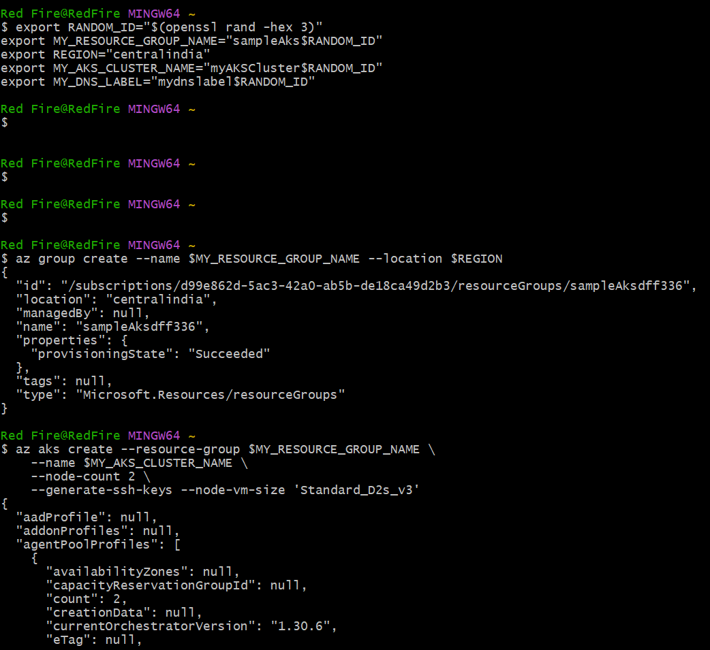
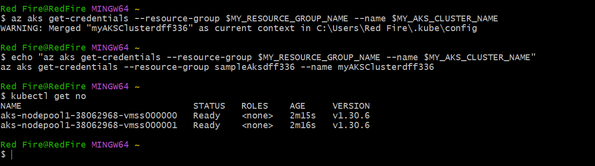

# firstly login to the cloud shell through azure portal
# execute below commands in cloud shell
# defining enviornment variables
```
export RANDOM_ID="$(openssl rand -hex 3)"
export MY_RESOURCE_GROUP_NAME="aks_grp$RANDOM_ID"
export REGION="centralindia"
export MY_AKS_CLUSTER_NAME="aks1$RANDOM_ID"
export MY_DNS_LABEL="mydnslabel$RANDOM_ID"
```

# creating resource group
`az group create --name $MY_RESOURCE_GROUP_NAME --location $REGION`
 
# creating AKS Cluster with new key
# here you can increase the nodes and size of the vm

```
az aks create --resource-group $MY_RESOURCE_GROUP_NAME \
    --name $MY_AKS_CLUSTER_NAME \
    --node-count 2 \
    --generate-ssh-keys --node-vm-size 'Standard_B2ms'\

    0r its work in free tier

az aks create --resource-group $MY_RESOURCE_GROUP_NAME \
    --name $MY_AKS_CLUSTER_NAME \
    --node-count 2 \
    --generate-ssh-keys --node-vm-size 'Standard_D2s_v3'
```
 
# conneting to the cluster
# getting credentials
`az aks get-credentials --resource-group $MY_RESOURCE_GROUP_NAME --name $MY_AKS_CLUSTER_NAME`
 
# for getting credentials on powershell execute below commandon
`echo "az aks get-credentials --resource-group $MY_RESOURCE_GROUP_NAME --name $MY_AKS_CLUSTER_NAME"`
# run the output on power shell
 



#  
```
$ kubectl version
Client Version: v1.31.2
Kustomize Version: v5.4.2
Server Version: v1.30.6

```
# to delete the cluster delete the resource group
`az group delete --name $MY_RESOURCE_GROUP_NAME --yes --no-wait`
 
# run below command on git bash to get auto-complete every time
source <(kubectl completion bash)
 
 
`az aks upgrade --resource-group $MY_RESOURCE_GROUP_NAME --name $MY_AKS_CLUSTER_NAME --node-image-only`